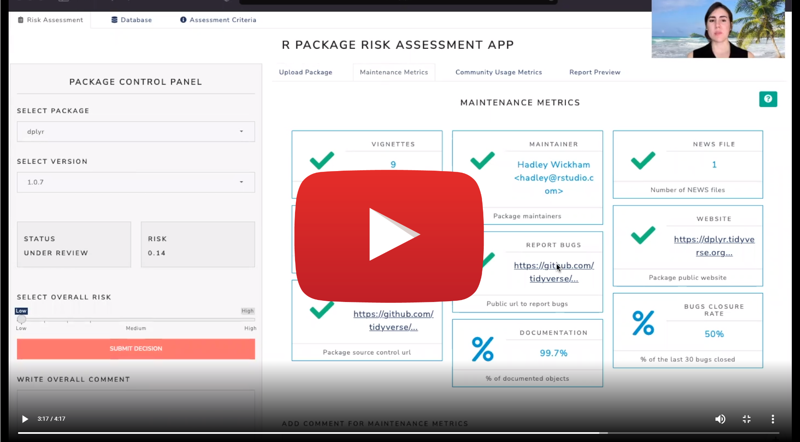

<!-- README.md is generated from README.Rmd. Please edit that file -->

```{r, include = FALSE}
knitr::opts_chunk$set(
  collapse = TRUE,
  comment = "#>",
  fig.path = "man/figures/README-",
  out.width = "100%"
)
```

# `{riskassessment}`: an extension of `{riskmetric}`

<!-- badges: start -->
  [](https://lifecycle.r-lib.org/articles/stages.html#experimental)
  [](https://codecov.io/github/pharmaR/riskassessment?branch=dev)
  <!-- badges: end -->

`riskassessment` is an R package containing a shiny front-end to augment the utility of the [`riskmetric`](https://github.com/pharmaR/riskmetric) package within an organizational context.

<br>

<center>
<a href="https://rinpharma.shinyapps.io/risk_assessment">

</a>
</center>

<br>

<br>


`riskmetric` is a framework to quantify an R package's "risk" by assessing a number of meaningful metrics designed to evaluate package development best practices, code documentation, community engagement, and development sustainability. Together, the `riskassessment` app and the `riskmetric` package aim to provide some context for validation within regulated industries.

The app extends the functionality of `riskmetric` by allowing
the reviewer to:

- analyze `riskmetric` output without the need to write code in R
- contribute personalized comments on the value of individual metrics
- categorize a package with an overall assessment (i.e., low, medium, or high risk) based on subjective opinions or after tabulating user(s) consensus after the evaluating metric output
- download a static reports with the package risk, metrics outputs, and reviewer comments, and more
- store assessments in a database for future viewing and historical backup
- user authentication with with admin roles to manage users and metric weighting


### Echo-ing `{riskmetric}`'s Approach to Validation

Validation can serve as an umbrella for various terms, and admittedly, companies will diverge on what is the correct approach to validation. The  validation approach we followed is based on the philosophy of the white paper set forth by the R Validation Hub: [White Paper](https://www.pharmar.org/white-paper/).


### Usage

If you are new to using the `riskassessment` app, welcome! We'd highly encourage you to start exploring the [`demo version`](https://rinpharma.shinyapps.io/risk_assessment) of the app currently deployed on shinyapps.io. There, you'll find a number of pre-loaded packages just waiting to be assessed. Hands on experience will help you become familiar with the general layout of the app as you poke around and explore.

With that said, you should immediately recognize that the app requires authentication, since it's intended use is within an organization. There are two pre-defined roles: 'nonadmin' users and 'admin' users. The latter can add/delete users, download an entire copy of the database, and modify the metric weights used in calculation of risk scores. Initially, both share the same password: `QWERTY1`. If you log in with this credential, the app will immediately prompt you to change your password and repeat the tje process with your new credentials.

If you want a quick tour through the app (or need assistance getting past the authentication wall), you should watch this short walk through on the R Consortium's website:

<br>

<center>
<a href="https://www.r-consortium.org/blog/2022/02/03/risk-assessment-shiny-app-update-from-r-validation-hub">

</a>
</center>


<br>

If you desire a more comprehensive overview of `riskmetric`'s approach to validation in the context of this app, watch our talk at [Rstudio::Global 2021](https://www.youtube.com/watch?v=4uVQXHpNmUQ). But don't forget to take it for a spin!

#### Installation

For those who are ready to run/deploy this application in their own environment, we'd recommend the below workflow to install the package. Note: the `riskassessment` package is not on CRAN yet, but you can easily install the latest version from GitHub using:

```{r, eval=FALSE}
# install.packages("remotes") # if needed
remotes::install_github("pharmaR/riskassessment")
```

With a simple `library(riskassessment)` you can access all the exported functions from `riskassessment` that help users reproduce analysis performed in the app. Or, you can create an `app.R` file and launch (or deploy) the application if you include the following line of code:

```{r, eval=FALSE}
# Run the application 
riskassessment::run_app()
```


#### Deployments

As you might expect, certain deployment environments offer persistent storage and others do not. For example, shinyapps.io does not. That means that even our [demo app](https://rinpharma.shinyapps.io/risk_assessment) that's hosted on shinyapps.io contains a a package database that can't be permanently altered. That's not advantageous since an organization needs to continually add new packages, publish comments, and make decisions about packages. Thus, we'd recommend exploring these deployment options (which allow persistent storage):

* Shiny Server

* RStudio Connect

* ShinyProxy

For more information on each of these, we highly recommend reading our deployments article.


### User Guides

We are currently working on improving the app and it's documentation. Since they are are currently in-progress, please explore the user guides that have been developed so far, available on the [documentation site](https://pharmar.github.io/riskassessment/).


### Contributors/Authors

We would like to thank all the contributors! Specifically, we would like to thank:

- [R Validation Hub](https://www.pharmar.org)
- [Aaron Clark](https://www.linkedin.com/in/dataaaronclark/), Biogen, *Maintainer*
- [Marly Gotti](https://www.marlygotti.com), Previously Biogen
- Robert Krajcik, Cytel
- Maya Gans, Cytel
- Aravind Reddy Kallem
- Fission Labs India Pvt Ltd

_Note:_ This app was made possible thanks to the [R Validation Hub](https://www.pharmar.org/about/), a collaboration to support the adoption of R within a biopharmaceutical regulatory setting.


### License

Please see the [License](LICENSE.md) file that lives alongside this repo.


<br>
