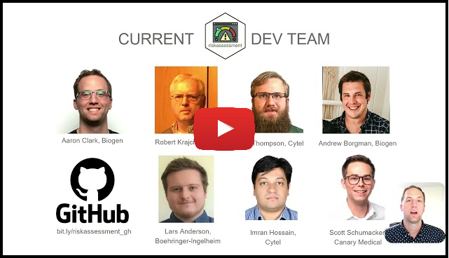
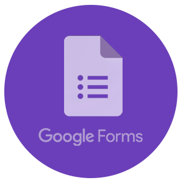
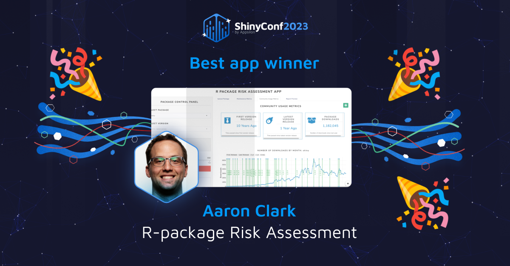

<!-- README.md is generated from README.Rmd. Please edit that file -->

# The `{riskassessment}` application <a href='https://pharmar.github.io/riskassessment/'></a>

<!-- badges: start -->

[](https://pharmaverse.org/e2eclinical/validation/)
[](https://RValidationHub.slack.com)
[](https://lifecycle.r-lib.org/articles/stages.html#experimental)
[](https://github.com/pharmaR/riskassessment/actions/workflows/R-CMD-check.yaml)
[](https://app.codecov.io/github/pharmaR/riskassessment)
<!-- badges: end -->

`riskassessment` is an R package containing a shiny front-end to augment
the utility of the [`riskmetric`](https://github.com/pharmaR/riskmetric)
package within an organizational context. We’re honored to announce this
app was recently awarded the title for “Best App” at [Shiny Conf
2023](https://youtu.be/gsWc_oSTb9c) (see [Recognition](#recognition)
section below).

<br>

<center>
<a href="https://rinpharma.shinyapps.io/riskassessment/"></a>
</center>

<br>

`riskmetric` is a framework to quantify an R package’s “risk of use” by
assessing a number of meaningful metrics designed to evaluate package
development best practices, code documentation, community engagement,
and development sustainability. Together, the `riskassessment` app and
the `riskmetric` package aim to provide some context for validation
within regulated industries.

The app extends the functionality of `riskmetric` by allowing the
reviewer to:

- analyze `riskmetric` output without the need to write code in R
- contribute personalized comments on the value of individual metrics
- categorize a package with an overall assessment (i.e., low, medium, or
  high risk) based on subjective opinions or after tabulating user(s)
  consensus after the evaluating metric output
- download a static reports with the package risk, metrics outputs, and
  reviewer summary & comments, plus more
- store assessments in a database for future viewing and historical
  backup
- user authentication with privileges & admin-defined roles to manage
  users and tasks performed in the app

### Echo-ing `{riskmetric}`’s Approach to Validation <a href='https://pharmar.github.io/riskmetric/'></a>

Validation can serve as an umbrella for various terms, and admittedly,
companies will diverge on what may be the “correct approach”. The
`riskassessment` app is built on a `rismetric`-foundation, whose
developers follow the validation philosophy proposed in [this white
paper](https://www.pharmar.org/white-paper/) published by the R
Validation Hub. As such, the scope of `riskassessment` and `riskmetric`
are only designed to support decision making from that view point. The
full robustness and reliability of any software may (and likely will)
require deeper inspection by the reviewing party.

*Note:* Development of both `riskassessment` and `riskmetric` were made
possible thanks to the [R Validation
Hub](https://www.pharmar.org/about/), a collaboration to support the
adoption of R within a biopharmaceutical regulatory setting.

### Usage

If you are new to using the `riskassessment` app, welcome! We’d highly
encourage you to start exploring the [demo
version](https://rinpharma.shinyapps.io/riskassessment/) of the app
currently deployed on shinyapps.io. There, you’ll find a number of
pre-loaded packages just waiting to be assessed. Hands on experience
will help you become familiar with the general layout of the app as you
poke around and explore.

With that said, you should immediately recognize that the app requires
authentication, since it’s intended use is within an organization. There
are several pre-defined roles, but the most important is the `admin`
user. By default, the `admin` can add/delete users, download an entire
copy of the database, and modify the metric weights used in calculation
of risk scores, define custom decision categories, and automation rules
base on risk scores. The demo version of the app tells prompts you with
how to log in initially. However, if you launch the `app.R` file
locally, the `admin` user will have to leverage the password `QWERTY1`
initially. If you log in with this credential, the app will immediately
prompt you to change your password and repeat the the process with your
new credentials.

If you want a quick overview of the project and demo of the application,
we highly recommend watching the following video walk through [from
Shiny Conf 2023](https://youtu.be/gsWc_oSTb9c). At the conference,
`riskassessment` was voted “best application” by conference attendees!
The app was also featured at [Rstudio::Global
2021](https://www.youtube.com/watch?v=4uVQXHpNmUQ).

<br>

<center>
<a href="https://youtu.be/gsWc_oSTb9c" target="_blank">

</a>
</center>

<br>

#### Installation

We recommend to run/deploy this application in a controlled development
environment. Of course, you can install the latest version from GitHub
using the code below, but it doesn’t take into consideration other
environment dependencies…

``` r
# DON'T RUN THIS CODE! There's a better way!
remotes::install_github("pharmaR/riskmetric")
remotes::install_github("pharmaR/riskassessment")

# Run the application 
riskassessment::run_app()
```

For example, what if you are using a different version of `riskmetric`
than our dev team? Thus, the development team can’t guarantee it’s
stability, and we recommend you clone the repo’s R project locally
instead. Once cloned/ forked, run the following code in order to take
advantage of our `renv.lock` file which set’s up the project
dependencies:

``` r
# First, clone the repo from GitHub, then...
# Get dependcies synced using {renv}
renv::activate()
renv::restore()
```

After this step is complete, you can simply run the contents of `app.R`
to launch and/or deploy the application with default settings! For more
information on our dev philosophy as it pertains to package management,
please read the [“Using
`renv`”](https://pharmar.github.io/riskassessment/articles/dev_renv.html)
article. Then, learn how to manipulate the app’s configuration away from
the defaults by reading the guide on
[“Deployment”](https://pharmar.github.io/riskassessment/articles/Deployment.html)
which covers how to use the app’s configuration file to tailor the app
to your needs.

### User Guides and User Feedback

<a href='https://pharmar.github.io/riskassessment/'></a>

We’re constantly improving the app and it’s documentation. Please
explore the user guides that have been developed to date, available on
the `riskassessment` [documentation
site](https://pharmar.github.io/riskassessment/). Be sure to read the
[‘Get
Started’](https://pharmar.github.io/riskassessment/articles/riskassessment.html)
tab and perhaps [another article or
two](https://pharmar.github.io/riskassessment/articles/index.html)!

Of course, if you ever have specific feedback for the developers, or if
you encounter a problem / bug within the app, we recommend [opening a
new issue](https://github.com/pharmaR/riskassessment/issues/new) on
GitHub and we’ll address it promptly.

<a href='https://forms.gle/ATiyNH9y25VeD2gdA'></a>

We also want to align with our users on big picture, strategic topics.
Specifically, we want to hear from groups who’ve built (or are currently
building) their R-package validation process, whether you use
`riskmetric` / `riskassessment` or not! Ideally, our goal is to form a
consensus from companies regarding their validation approach so we can
make `riskmetric` and `riskassessment` better. For example, we’d love to
understand how users are currently weighting the metrics used to
calculate a package’s risk score. We’d also love to learn if companies
leverage certain risk score thresholds to make GxP environment inclusion
(or exclusion) decisions for a package. To facilitate the gathering of
this information, we’ve created an [incredibly brief
questionnaire](https://forms.gle/ATiyNH9y25VeD2gdA) to let us know where
you’re at.

#### Deployment

As you might expect, certain deployment environments offer persistent
storage and others do not. For example, shinyapps.io does not. That
means that even our [demo
app](https://rinpharma.shinyapps.io/riskassessment/) that’s hosted on
shinyapps.io contains a a package database that can’t be permanently
altered. That’s not advantageous since an organization needs to
continually add new packages, publish comments, and make decisions about
packages. Thus, we’d recommend exploring these deployment options (which
allow persistent storage):

- Shiny Server

- Posit Connect

- ShinyProxy

For more information on each of these, we highly recommend reading our
[‘Deployment’
article](https://pharmar.github.io/riskassessment/articles/Deployment.html).

#### Recognition

In March 2023, Appsilon hosted the 2nd annual [Shiny
Conf](https://shinyconf.appsilon.com/) which was fully virtual, boasting
approximately 4k registrants. Aaron Clark, package maintainer and R
Validation Hub Executive member,
[presented](https://youtu.be/gsWc_oSTb9c) the `{riskassessment}` app
work in the “Shiny Showcase” among 20+ other app submissions. At the end
of the conference, `{riskassessment}` was awarded the title of “Best
App” by popular vote.

<br>

<center>
<a href="https://rinpharma.shinyapps.io/riskassessment/"></a>
</center>

<br>
