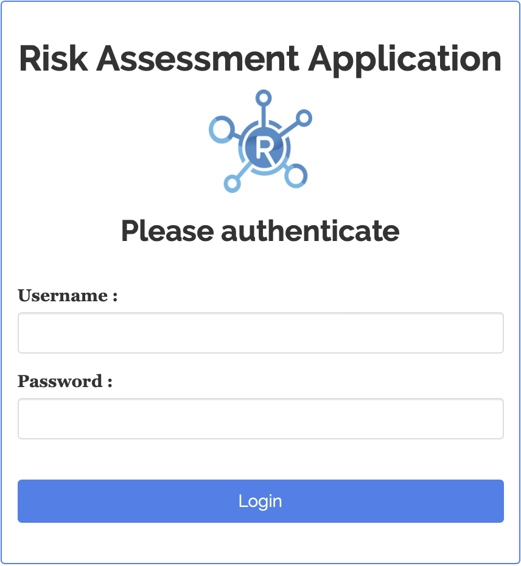

```{r setup, include=FALSE}
# Load packages.
library(fontawesome)

knitr::opts_chunk$set(echo = TRUE)
```

<br><br><br>

## Introduction

This guide will help you set up users and credentials for the Risk Assessment App.
Some of these instructions apply only to the first time the app is ran, and others
apply to any moment in which new users need to be added.

## First time running the app

### Keyring password

The first time the application is ran (and only then), a prompt will ask you to
create a keyring password.

{width=400px style="margin: 10px 0 10px 0"}

This keyring password allows to view/retrieve users
and passwords from the credentials database, as such, it is extremely important
to store it in a safe place.

### Default user

After creating the keyring password, the login screen of the app will appear:

{width=300px style="margin: 10px 0 10px 0"}

The Risk Assessment App is initially set up for one user, **admin**,
with administrator authority, and a default password of **qwerty**. Use this
credential to login. You will be prompted to change the password right after
the first login:

{width=300px style="margin: 10px 0 10px 0"}


## Administrator mode 

Only admins can add/delete users. To navigate to the administrator's mode,
first click on the plus `r fa("plus")` symbol at the bottom-right corner,
followed by the Administrator mode button:

{width=500px align=center style="margin: 10px 0 10px 0"}

This button will not be displayed for non-admin users.

### Adding users

Two tables are presented. The first one is used to manage users,
and the second one to manage passwords.

 


 Now would be a good time to add users!</br> 
 At the top of the Users table, click "add user"
   

 
 A pop-up screen will appear where you can add the user name and **optional** start and expire dates
 as well as a checkbox to grant administrator authority.  A default password is created and (by default) the user will 
 be required to change it the first time they log in.
 
  
 
 A confirmation message will appear, so you can notify the user and send them the temporary password.</br>
   
   
## start and expire dates

If either the **start** date is set to *after* today's date or the **expire** date is set to *before* today's date,
an "account expired" message will appear, and the login attempt will fail.</br>
As administrator, you can set either or both of these dates or leave them blank for no start or expiration.

   

## Editing and deleting users

The first table allows editing and deleting users.

    

### Edit current user
Edit user information clicking on the blue <a style="color:blue">*edit*</a> button on the table.

### Delete a user
Delete a user by clicking on the red <a style="color:red">*remove*</a> button on the table.

### Notes

- User: You cannot delete or create an existing user
- start & expire: Keep empty for no date restriction
- When adding a new user: by default, a temporary password is generated. But you can replace it with your own password and disable asking user to change it on first log-in.

## Replace yourself?
As an administrator, you can even replace your current user ID with another one.  
Note that **you cannot delete yourself**, so you will need to create another user ID first.</br>
This time, click "add user" and check the admin box.
 
The temporary password can be overridden by un-checking the "ask to change password" box.</br>
Maybe replace the temporary password with something you can remember.
 
    
</br></br>Now sign on to this new administrator user ID and delete the original "admin" user by checking 
the red <a style="color:red">remove"</a> button next to it.


## Password management

The second table allows password management:
    


Click on the blue <a style="color:blue">*Change password*</a> button to force he user to change the password on the next log-in.

Click on the orange <a style="color:orange">*Reset password*</a> button to generate a temporary password.
Please give this to the user.

### Additional information:

- Must change: The user has to change the password next log-in.
- Have changed: The user has already changed the password.
- Date change: Date the password was updated.

