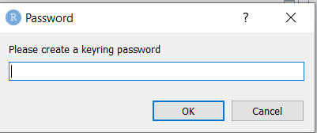
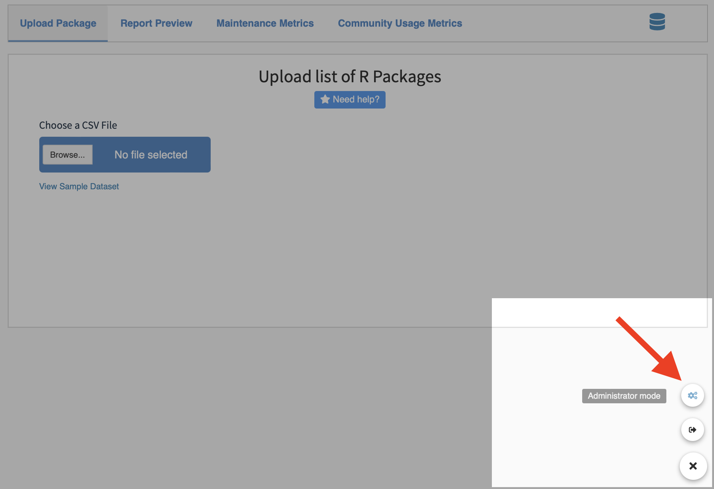
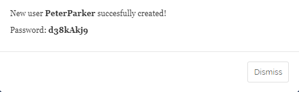
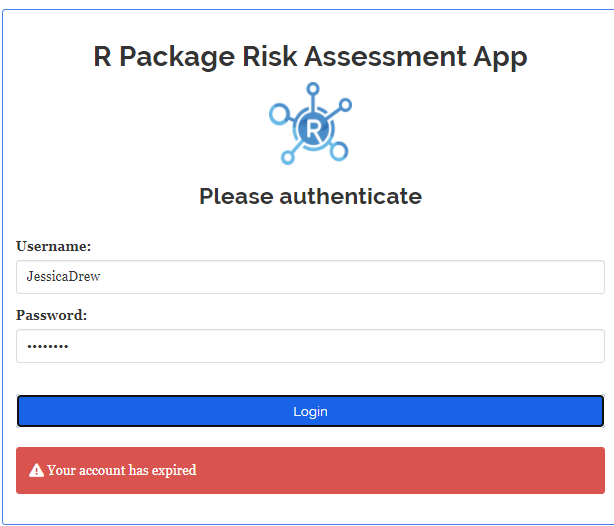

```{r setup, include=FALSE}
# Load packages.
library(fontawesome)

knitr::opts_chunk$set(echo = TRUE)
```

<br><br><br>

## Introduction

This guide will help you set up users and credentials for the Risk Assessment App. Some of these instructions apply only to the first time the app is run while others are for any time new users need to be added.

## First time running the app

### Keyring password

The first time the application is run (and only then), a prompt will ask you to create a keyring password.

<center>

{width=400px style="margin: 10px 0 10px 0"}

</center>

The keyring password entered here will allow a user to view/retrieve username and password values from the credentials database at a later time. As such, it is extremely important to store it in a safe place.

### Default user

After creating the keyring password, the login prompt appears. The app is initially set up with one username, **admin**, and a default password of **qwerty**. Type in these credentials (as seen below) to login with administrator authority.

<center>

{width=350px style="margin: 10px 0 10px 0"}

</center>

The user will be immediately prompted to change the password for the **admin** username right away:

<center>

{width=350px style="margin: 10px 0 10px 0"}

</center>

<br>

## Administrator mode 

Only users with administrator privileges can add/delete/modify user accounts. To verify you have access to the administrator mode, hover your cursor over the plus `r fa("plus")` symbol in the bottom-right corner of the app. Upon clicking, additional options should appear. If present, the Administrator mode button will appear on top, as seen below:

<center>

{width=750px style="margin: 10px 0 10px 0"}

</center>

This button will not be appear for non-admin users.

<br>

<br>

### Adding users

Two tables are presented. The first one is used to manage users, and the second one to manage passwords.

<center>

{width=750px}

</center>

<br> 

Now would be a good time to add users! At the top of the **Users** table, click the long blue button labelled: "Add a user".
 
<center>

{width=750px}

</center>

<br>

A prompt will appear where you can add the user name and **optional** start and expire dates (more on those later) as well as a check box to grant the new user administrator authority. A default password is created and (by default) the new user will be required to change it the first time they log in.
 
 
<center>

{width=750px}

</center>

<br>

A confirmation message will appear, so you can notify the user and send them their temporary password.</br>
 
<center>



</center>
   
## User account start and expire dates

If either the **start** date is set to *after* today's date or the **expire** date is set to *before* today's date, an "account expired" message will appear, and the login attempt will fail.

<br>

As administrator, you can set either or both of these dates or leave them blank for no start or expiration.

<center>



</center>

## Editing and deleting users

The first table allows editing and deleting users.

<center>

 

</center>

### Edit current user

Edit user information clicking on the blue <a style="color:blue">*edit*</a> button on the table.

### Delete a user

Delete a user by clicking on the red <a style="color:red">*remove*</a> button on the table.

### Notes

- User: You cannot delete or create an existing user
- start & expire: Keep empty for no date restriction
- When adding a new user: by default, a temporary password is generated. But you can replace it with your own password and disable asking user to change it on first log-in.

## Replace yourself?
As an administrator, you can even replace your current user ID with another one.  
Note that **you cannot delete yourself**, so you will need to create another user ID first.</br>
This time, click "add user" and check the admin box.
 
The temporary password can be overridden by un-checking the "ask to change password" box.</br>
Maybe replace the temporary password with something you can remember.
 
<center>

 
</center>

</br></br>Now sign on to this new administrator user ID and delete the original "admin" user by checking 
the red <a style="color:red">remove"</a> button next to it.


## Password management

The second table allows password management:

<center>

    

</center>

Click on the blue <a style="color:blue">*Change password*</a> button to force he user to change the password on the next log-in.

Click on the orange <a style="color:orange">*Reset password*</a> button to generate a temporary password.
Please give this to the user.

### Additional information:

- Must change: The user has to change the password next log-in.
- Have changed: The user has already changed the password.
- Date change: Date the password was updated.

