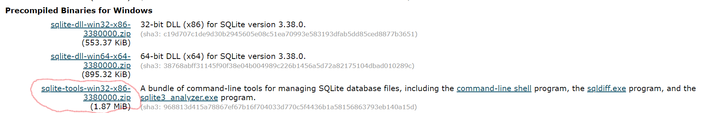
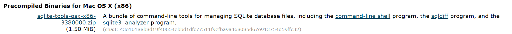
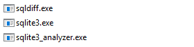
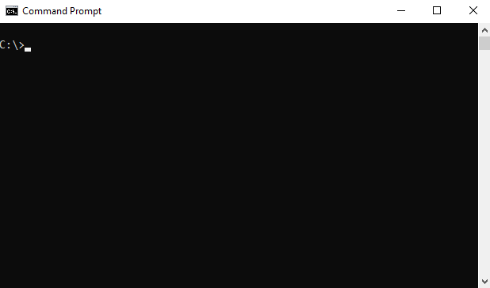
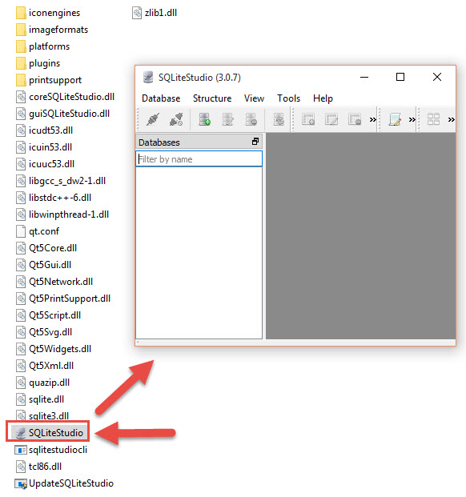

<style type="text/css">
  body{
  font-size: 14pt;
}
</style>


```{r setup, include=FALSE}
knitr::opts_chunk$set(echo = TRUE)
```


### About SQLite

SQLite is a software library that provides a relational database management system. The lite in SQLite means lightweight in terms of setup, database administration, and required resources.

SQLite has the following noticeable features: self-contained, serverless, zero-configuration, transactional.

For more information, see [What is SQLite](https://www.sqlitetutorial.net/what-is-sqlite/)
</br></br>

### Why SQLite?

For one obvious reason -- all the Risk Assessment App data is stored in a SQLite database.
Also, one of SQLite's advantages is that it can run nearly anywhere. 
This vignette will provide you with the means of accessing the database outside of 
the Risk Assessment App.
</br></br>

### Download SQLite tools

Open the download page [SQLite Download Page](https://www.sqlite.org/download.html)

To work with SQLite on Windows, </br>you download the command-line shell program as shown in the screenshot below.
  
  
</br>
If you are using a Mac, </br>you need to download this one:
  
</br></br>
In either case, the downloaded file is in ZIP format and its size is quite small.
</br></br>

### Run SQLite tools

Installing SQLite is simple and straightforward.

Create a new folder e.g., `C:\sqlite`. 

Extract the content of the .zip file that you downloaded in the previous section to the `C:\sqlite` folder. You should see three programs as shown below:

 
</br></br>

### Open the command line window.  

On Windows, type "cmd" in the search bar.

 
</br></br>

### Navigate to the `C:\sqlite` folder.

```{R, eval=FALSE}
C:\cd c:\sqlite
C:\sqlite>
```

Next, type `sqlite3` and press enter, you should see the following output:

```{R, eval=FALSE}
C:\sqlite>sqlite3

SQLite version 3.33.0 2020-08-14 13:23:32

Enter ".help" for usage hints.

Connected to a transient in-memory database.

Use ".open FILENAME" to reopen on a persistent database.

sqlite>
```  

Navigate to the directory containing the `riskassessment` database. Note: the app's default behavior is to call this database "database.sqlite", unless you've specified otherwise using the `assessment_db_name` arg in `run_app()`. Next, use the `.open FILENAME` command to open it. For example:

`.open database.sqlite;`

To show the tables, type `.tables`

```{r, eval=FALSE}
sqlite> .tables
comments                 metric                   package_metrics
community_usage_metrics  package
sqlite>
```

To show the structure of a table, type `.schema TABLE`

```{r, eval=FALSE}
sqlite> .schema package_metrics
CREATE TABLE package_metrics (   id           INTEGER PRIMARY KEY AUTOINCREMENT,   package_id   INT,    metric_id    INT,   value        CHAR,   /* value == 'pkg_metric_error' indicates an error. */   /* value == NA indicates metric is not applicable for this package. */   weight       REAL,   FOREIGN KEY (package_id) REFERENCES package(id),   FOREIGN KEY (metric_id) REFERENCES metric(id));
sqlite>
```

You can also type `.help` from the sqlite> prompt to see all available commands.

```{r, eval=FALSE}
sqlite> .help
.archive ...             Manage SQL archives
.auth ON|OFF             Show authorizer callbacks
.backup ?DB? FILE        Backup DB (default "main") to FILE
.bail on|off             Stop after hitting an error.  Default OFF
.binary on|off           Turn binary output on or off.  Default OFF
.cd DIRECTORY            Change the working directory to DIRECTORY
.changes on|off          Show number of rows changed by SQL
.check GLOB              Fail if output since .testcase does not match
.clone NEWDB             Clone data into NEWDB from the existing database
.databases               List names and files of attached databases
.dbconfig ?op? ?val?     List or change sqlite3_db_config() options
.dbinfo ?DB?             Show status information about the database
.dump ?TABLE?            Render database content as SQL
.echo on|off             Turn command echo on or off
.eqp on|off|full|...     Enable or disable automatic EXPLAIN QUERY PLAN
.excel                   Display the output of next command in spreadsheet
...
additional output not displayed
```

To exit, type `.quit`or `.exit`
</br></br>

### Command Line Shell

You can also *temporarily* add `C:\sqlite` to the Windows path.

`set PATH=%PATH%;C:\sqlite`

Verify by typing

`echo %PATH%`

Then when you are in the `riskassessment` directory, you can just enter the following on the command line:

`sqlite3 database.sqlite`
and then you will see

```{r,eval=FALSE}
SQLite version 3.33.0 2020-08-14 13:23:32
Enter ".help" for usage hints.
sqlite> 
```

You can also use the `system2` command to execute SQLite commands on the RStudio command line.

```{r, eval=FALSE}
> system2("C:/sqlite/sqlite3", args =c("database.sqlite", ".tables", ".quit"))
comments                 metric                   package_metrics        
community_usage_metrics  package     
```

And you can build queries or commands for SQLite and execute them.

```{r, eval=FALSE}
> table_name <- "package"
> query <- glue::glue("select * from { table_name } limit 1;")
> frst_row <- system2("C:/sqlite/sqlite3", args ="database.sqlite", input = query, stdout = TRUE)
> 
> frst_row
[1] "1|glue|1.6.2|glue: Interpreted String Literals|An implementation of interpreted string literals, inspired by   Pythons Literal String Interpolation   <https://www.python.org/dev/peps/pep-0498/> and Docstrings   <https://www.python.org/dev/peps/pep-0257/> and Julias Triple-Quoted   String Literals   <https://docs.julialang.org/en/v1.3/manual/strings/#Triple-Quoted-String-Literals-1>.|Jennifer Bryan  <jenny at rstudio.com>|Jim Hester  [aut], Jennifer Bryan    [aut, cre], RStudio [cph, fnd]|MIT + file LICENSE|2022-02-24|0.11|||2022-02-24"
```

For more info, see [Command Line Shell for SQLite](https://sqlite.org/cli.html)

</br></br>

### SQLiteStudio

The SQLiteStudio tool is a free GUI tool for managing SQLite databases. It is free, portable, intuitive, and cross-platform. SQLite tool also provides some of the most important features to work with SQLite databases such as importing, exporting data in various formats including CSV, XML, and JSON.

Visit [SQLite Studio](https://sqlitestudio.pl/)

You can download the SQLiteStudio installer or its portable version by visiting the download page.  Then, you can extract (or install) the download file to a folder e.g., C:\sqlite\gui\ and launch it.

The following picture illustrates how to launch the SQLiteStudio:

 
