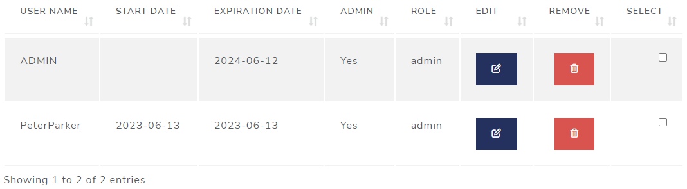

```{r setup, include=FALSE}
# Load packages.
library(fontawesome)

knitr::opts_chunk$set(echo = TRUE)
```

<br><br><br>

# Introduction

This guide is to assist admins with managing credentials (user IDs and passwords) and Assessment Reweighting for the Risk Assessment App. 


Only users with administrator privileges have access to the Administrative Tools and Options section. To verify your access to  this, first check that you can see all four navigation tabs at the top of the app, with the rightmost one showing "Administrative Tools".

<left>

{style="margin: 10px 0 10px 0"}

{style="float:right; width:139px; height:236px"}
</br> You can also hover your cursor over the xmark `r fa("xmark")` symbol in the bottom-right corner of the page on the "Upload Packages" tab. Upon hovering, two additional buttons should appear. The middle one is the logout `r fa("right-from-bracket")` button,  while the Administrator mode `r fa("gears")` button will appear on top, as shown.  This button will not appear from non-admin users.

</br></br></br></br></br>

Once you have selected "Administrative Tools",
you should see two tabs here.

The first is "Credential Manager" and the second is "Assessment Reweighting."


</br>

## Credential Manager

Two tables are presented. The first one, indicated by the `r fa("users")` Users icon, is used to manage users.
</br>The the second one, indicated by the `r fa("key")` key icon, is used to manage passwords.
There is also a button at the bottom to download a copy of the current sqlite database.

<left>

{width=750px}

</left>

### Managing Users

The first table allows adding, editing, and deleting users.

#### Add a User

{width=142px style="float:right"}
Now would be a good time to add some users. 
</br></br></br>
At the top of the **Users** table, click the dark blue button labelled: "Add a user".
 
</br></br></br></br></br>

{width=411px, height=560px, style="float:right"}
</br>
A prompt will appear where you can specify a user name as well as **optional** start & expire dates.  These are by default set to today's date (more on those later). 
</br></br>Here, we'll type "PeterParker" into the User name field.
</br></br></br></br></br></br></br></br></br></br></br>
A check box to grant the new user administrator authority is also checked by default. A custom password is generated which will require changing the first time the new user logs in, if the "Ask to change password" box remains checked. 


</br></br></br>
</br></br></br></br></br></br>
</br>


{width=410px, height=158px, style="float:right"}
</br>Upon clicking "Confirm New User", a confirmation modal will appear, so you can notify the user and send them his/her temporary password.
</br></br></br></br></br></br></br>

#### User `start` and `expire` dates

</br>
{style="float:right; width:312px; height:162px"}

If either the **start** date is set to a future date or the **expire** date is set to *before* today's date, an "account expired" message will appear, and the log in attempt will fail.  

<br>

As an administrator, you can set either or both of these dates or just leave
them blank.

<br>

#### Edit a user

{style="position:left; width:780px; height:174px"}

Edit user information by clicking on the dark blue `r fa(name = "pen-to-square", fill = "darkblue", height = "1em")` <a style="color:darkblue">Edit</a> button, found on the right-hand side of the table.</br></br>


An Edit User window will appear.

{style="position:left; width:416px; height:478px"}

Make your changes, and then click on "Confirm Change"</br>

{style="position:left; width:343px; height:124px"}

A small modal will briefly appear indicating the user has been updated.

<br>

#### More Edit options

At the bottom of this table is a bar with three buttons. 
{style="position:left; width:456px; height:59px"}

The first one is a checkbox `r fa(name = "square-check", fill = "red", height = "1em")`
to select multiple users followed by an "Edit Selected Users" and a "Remove Selected Users" button.

These buttons are enabled when you select two or more users.

{style="float:right; width:406px; height:327px"}

</br></br>But the "Edit Selected Users" button only allows you to modify the start and expire dates for that selected group of users.

Make your changes, and then click on "Confirm Change"

Again, A small modal will briefly appear indicating the user has been updated.

</br></br></br></br></br></br></br>

#### Delete a user

Delete any user by clicking on the red `r fa(name = "trash-can", fill = "red", height = "1em")` 
<a style="color:red">Remove</a> button, also on the right-hand side of the table.

You will see a confirmatory modal message

<left>
{width=410px, height=151px}

You can also select multiple users like you did with editing multiple users and click on the "Remove Selected Users" button at the bottom of the table.
{style="position:left; width:456px; height:59px"}

#### Replace initial `Admin` user

{style="float:right; width:410px; height:557px"} 
<br>As an administrator, it's recommended you replace your initial `admin` user ID with one unique to you. Note that there must always be **at least** one admin user, and **you cannot delete yourself!**  If you want to delete the initial `admin` user you will first need to create another user ID first with administrative privileges, as described below.

Click the blue "Add a user" button and make sure to check the `Admin` box. The temporary password can be overridden by un-checking the "ask to change password" box and setting the password to whatever you want.

</br>

After completing the form, sign in using your new credentials and delete the original `admin` user by clicking on the red `r fa(name = "trash-can", fill = "red", height = "1em")` <a style="color:red">Remove</a> button on the "admin" row.

</br></br></br></br></br></br></br></br></br>


### Managing Passwords

The second table allows for password management.

<left>

{style="position:left; width:780px; height:184px"} 

</left>

Click on the dark blue `r fa(name = "key", fill = "darkblue", height = "1em")`<a style="color:darkblue">*Change password*</a> button to force
corresponding user to change his/her password on the next log-in.

Click on the orange `r fa(name = "arrow-rotate-left", fill = "orange", height = "1em")`
<a style="color:orange">*Reset password*</a> button to generate a temporary password. 
</br>You are responsible for delivering the new password to the user.

<br>

Like the bottom of the User table, There is also a
checkbox `r fa(name = "square-check", fill = "red", height = "1em")`
to select multiple users followed by a "Force Selected Users to Change Password" button.

This button is enabled when you select two or more users.

{width=395px, height=47px}
</br>

#### Additional column definitions:

- Must change column: Indicates whether the user has to change his/her password
next log-in.
- Have changed column: Indicates the user has already changed his/her password.
- Date Last changed column: Indicates the date the password was updated.

<br>

## Assessment Reweighting


{width=800px, height=400px}
</br></br>On this tab, the first thing we are going to cover is setting and updating weights.

{width=812px, height=160px}
Here you can either select a metric from the "Select metric" dropdown box
or select a roww in the "CURRENT RISK SCORE WEIGHTS BY METRIC" table.

Now enter a new weight in the "Choose new weight" box and select
the <a style="color:red">"Update Weight"</a> button

After you have updated **at least one* metric weight,
the "Re-Calculate" button is enabled, allowing you to 
apply new weights and re-calculated risk for each package.

{width=481px, height=165px}

{width=392px, height=160px}
There is also a "Download" button available, which will download a copy of the current database ("database.sqlite") 

