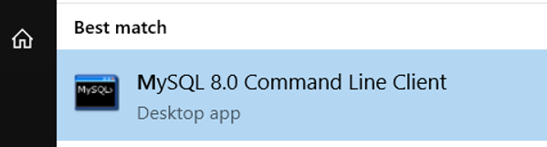
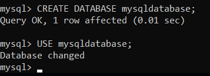

```{r setup, include=FALSE}
knitr::opts_chunk$set(echo = TRUE)
```

## Why change?

Perhaps you want to use a remote storage location multiple users can access the same data intead of each user having their own "silo" on their own laptop or desktop.

Take a look at this blog by Dean Attali:
[Persistent Data Storage](https://shiny.rstudio.com/articles/persistent-data-storage.html)

## Set up MySQL.

- Download the MySQL software from MYSQL Community Downloads:
https://dev.mysql.com/downloads/mysql/5.5.html?os=3&version=5

- Next, install (or get IT to install for you) the msi file you downloaded:
`mysql-installer-web-community-8.0.21.0.msi`

- During installation, set up your root (admin) and user passwords and save them.

- The MySQL reference guide is your friend.  Keep it handy:
https://dev.mysql.com/doc/refman/8.0/en/

- Next, start the MySQL command line client and create a database<br>
  

- Now it's time to create a database. Note the name is case-sensitive.<br>
  type: `CREATE DATABASE mysqldatabase;`<br>
  on the command line.  Note the semicolon at the end.<br>
  and then type: `USE mysqldatabase;`<br>
  to select it.<br>
  
  <br>

- Databases are created in "C:\\ProgramData\\MySQL\\MySQL Server 8.0\\Data"

- To remove a database, type: `DROP DATABASE mysqldatabase;`

## Shiny Modifications.

- In R, type: `install.packages("RMySQL")`

- In `setup.R`, replace `"RSQLite"` with `"RMySQL"`

- Add add these two lines at the bottom of `setup.R`
```{r, eval = FALSE}
options(shiny.port = 1221)         # default port number for shiny
options(shiny.host = '127.0.0.1')  # use '127.0.0.1' for local access
```

In `utils.R` make the following changes:
```{r, eval = FALSE}
# Stores the database name.
# db_name <- "database.sql"

db_name <- "mysqldatabase"
db_user <- Sys.getenv("USERNAME")
# db_password <- "mysqlpassword"
db_password <- rstudioapi::askForPassword("Please enter your password")

db_host <- unlist(unname(options("shiny.host"))) 
db_port <- 3306  # port for mysql
```
Instead of hardcoding the MySQL user password, I opted to ask for it the first time around and save it.  Note the port number for MySQL is 3306.

Now for some more changes.
in the `create_db()` function inside `utils.R` 
```{r, eval = FALSE}
# Create a local database.
create_db <- function(){
  
  # Create an empty database.
  # con <- dbConnect(RMySQL::MySQL(), db_name)

  con <-  dbConnect(RMySQL::MySQL(), user = db_user,
                    password = db_password,
                    dbname = db_name, host = db_host, port = db_port)
  
  alltables = dbListTables(con)
  
  observe(print(paste("alltables:",paste(alltables,collapse=", "))))
  
  # create tables if there aren't any yet
  if (is_empty(alltables)) {
    
  # Set the path to the queries.
  ...  # code omitted
    
    dbClearResult(res)
  })
  } # if (is_empty(alltables))
  
  dbDisconnect(con)
}
```

Now change the code for the `db_fun()` and `db_ins()` functions like this:
```{r, eval = FALSE}
 # con <- dbConnect(RSQLite::SQLite(), db_name)
 
  con <-  dbConnect(RMySQL::MySQL(), user = db_user, password = db_password,
                    dbname = db_name, host = db_host, port = db_port)
```

## Setup the Tables

SQLite is very forgiving about specifying data types.  Not so with MySQL.

The easiest way for me to guess what the Types and lengths should be was to take the SQLite database created and dump it using the sqlite3 utility:

`sqlite3 database.sqlite .dump > datadump`


