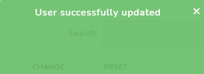
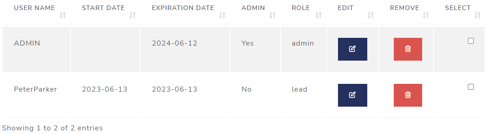

```{r setup, include=FALSE}
# Load packages.
library(fontawesome)

knitr::opts_chunk$set(echo = TRUE)
```

</br></br></br>

# The `admin` Privilege

Starting with Version 2.0.0, there has been a major overhaul on how privileges function within the application. Privileges are now tied to user roles! This allows additional flexibility to manage a user's access. However, there is one privilege whose assignment is mandatory for app deployment: the `admin` privilege. The `admin` privilege is important (and required for at least one user) because this person will manage the credentials and roles for all other users. Though it can be changed, the default app configuration gives `admin`s access to all other privileges. To learn more about the other privileges, further details are provided in the ["User Roles and Privileges" guide](User_Roles_and_Privileges.html).

We'll use this vignette to discuss the only `admin`-specific privilege: credentials management. To verify you have `admin` access, first check that you can see all THE navigation tabs within the app, especially the rightmost <a style="color:darkblue">**Administrative Tools**<a/> tab. If you do not see this tab, you have not been granted access! To gain access, you'll have to request access from a known `admin` user within your organization.

<br>

<center>
{style="margin: 10px 0 10px 0"}
</center>

{style="float:right; width:60px; margin-left: 20px;"}

<br>

You can also hover your cursor over the `r fa("plus")` symbol in the bottom-right corner of the page. Upon hovering, two additional buttons should appear. The middle one is the log out `r fa("right-from-bracket")` button,  while the Administrator mode `r fa("gears")` button will appear on top, as shown. This button will not appear for non-`admin` users.


<br>


Once you have selected the <a style="color:darkblue">**Administrative Tools**<a/> tab, there are currently two areas available for review: the first is `Credential Manager` and the second is `Roles & Privileges`, as seen below. Note: you may also see a tab labelled `Assessment Reweighting`, which is connected to a different privilege which may be included in your role.

<br>

<center>

</center>

</br>

<br>

# The Credential Manager

The Credential Manager tab is shown by default which contains two tables: 

* The first one, indicated by the `r fa("users")` Users icon, is used to manage users.

* The the second one, indicated by the `r fa("key")` key icon, is used to manage passwords.

There is also a button at the bottom to download a copy of the current sqlite database.

<br>

{style="position:center; width:790px"}
<br>

{style="position:center; width:790px"}

<br>

## Managing Users

The first table provides tools for managing of users: adding, editing, and deleting.

<br>

### Add a User

{style="align:left; width:142px"}


<br>


To add a new user, click the button labelled: "Add a user".
 

<br>

{style="float:right; width:411px; margin-left: 20px;"}
</br></br>

A prompt will appear where you can specify a user name, as well as **optional** start & expire date for that new member. By default set to today's date (more on that later). 

</br></br></br>

Here, we'll type "PeterParker" into the User Name field.

</br></br></br></br></br></br></br></br>

Notice the `r fa(name = "square-check", fill = "darkblue", height = "1em")` checkbox to grant the new user administrator privileges is also checked by default. A unique password is generated which the user will be prompted to change the first time he/she logs on, as long as the "Ask to change password" box remains checked. 

<br>

<br>

<br>

<br>

Upon clicking <a style="color:darkblue">**CONFIRM NEW USER**<a/>, a confirmation modal will appear. Now would be a good time to notify the user by sending them their userid and temporary password.


<br>

<center>
{style="width:410px"}
</center>

<br>

### User `start` and `expire` dates


<br>

{style="float:right; width:312px; margin-left: 20px;"}

If either the **start** date is set to a future date or the **expire** date is set to **before** today's date, an <a style="color:red">**account expired**<a/> message will appear, and the log-on attempt will fail.  

</br>

Feel free to set either or both of these dates as needed, or just leave them blank to ignore/avoid time-based access for a particular user.

</br>

<br>

### Edit a user

<br>

{style="position:center; width:780px"}

<br>

Edit user information by clicking on the `r fa(name = "pen-to-square", fill = "darkblue", height = "1em")` <a style="color:darkblue">**EDIT**</a> button, found on the right-hand side of the table.</br></br>


An `Edit User` window will appear:

<br>

<center>
{style="position:center; width:416px"}
</center>

<br>

Make your changes, and then click on <a style="color:darkblue">**CONFIRM CHANGE**<a/>.</br>

<br>

<center>
{style="position:center; width:343px"}
</center>

<br>

A small modal dialog box will appear (briefly) indicating the user has been successfully updated.


<br>


### More Edit options

At the bottom of this table is a bar with three buttons:

<br>

<center>
{style="position:left; width:456px"}
</center>

<br>


The first one is a `r fa(name = "square-check", fill = "red", height = "1em")` checkbox to select multiple users followed by an `r fa(name = "pen-to-square", fill = "darkblue", height = "1em")` <a style="color:darkblue">**EDIT SELECTED USERS**<a/> and a `r fa(name = "trash-can", fill = "red", height = "1em")` <a style="color:red">**REMOVE SELECTED USERS**<a/> button. These buttons are enabled when you select **two or more** users.

<br>

<center>
{style="float:left; width:406px; margin-right: 20px;"}
</center>

Note the "Edit Selected Users" button only allows you to modify the `start` and `expire` dates for that selected group of users.

<br>

After you've made your changes, click <a style="color:darkblue">**CONFIRM CHANGE**<a/>.

<br>

<br>

<br>

Again, a small modal dialog box will briefly appear indicating the users have been updated.

<br>

<center>
{style="width:257px"}
</center>

<br>

### Delete a user

<br>

{style="position:center; width:780px"}

<br>

</br>Delete any user by clicking on the `r fa(name = "trash-can", fill = "red", height = "1em")` 
<a style="color:red">**REMOVE**</a> button on the right-hand side of the table. You will see a confirmatory modal dialog box.  Click on "Delete User(s)."

<br>

<center>
{style="position:center; width:410px"}
</center>

<br>

You can also delete multiple users like you did with editing multiple users. Just click on the `r fa(name = "trash-can", fill = "red", height = "1em")` <a style="color:red">**REMOVE SELECTED USERS**</a> button at the bottom of the table.

<br>

<center>
{style="position:left; width:456px"}
</center>

<br>

The same confirmatory modal dialog box will appear.  Click on <a style="color:red">**DELETE USER(S)**</a>.

<br>

<center>
{style="position:center; width:410px"}
</center>

<br>


### Replace initial `admin` user

{style="float:right; width:410px; margin-left: 20px;"} 


As an administrator, it's recommended you replace the initial `admin` user ID created the first time the app is launched. Note that there must always be **at least** one admin user, and **you cannot delete yourself!**  If you want to delete the initial `admin` user you will first need to create another user ID with administrative privileges, as described below.

</br>

Just as before, click the "Add a user" button and make sure to check the `Admin` box. The temporary password can be overridden by un-checking the "ask to change password" box and setting the password to whatever you want.

</br>

After completing the form, sign in using your new credentials and delete the original `admin` user by clicking on the `r fa(name = "trash-can", fill = "red", height = "1em")` <a style="color:red">**REMOVE**</a> button on that row of the table.

</br></br></br></br></br></br></br></br></br>


<br>

## Managing Passwords

The second table allows for password management.

<br>

{style="position:center; width:780px"} 

<br>

Click on the `r fa(name = "key", fill = "darkblue", height = "1em")`<a style="color:darkblue">**CHANGE PASSWORD**</a> button to force the corresponding user to change his/her password on the next log-in.

A confirmatory modal dialog box will appear, like this:

<br>

<center>
{style="position:center; width:416px"} 
</center>

<br>

If you click on the `r fa(name = "arrow-rotate-left", fill = "orange", height = "1em")` <a style="color:orange">**RESET PASSWORD**</a> button to generate a temporary password. 

Again, a confirmatory modal dialog box will appear, like this:

<br>

<center>
{style="position:center; width:416px"}
</center>

</br>

Click on <a style="color:darkblue">**CONFIRM**<a/> and you will see another modal dialog box with the new temporary password in it.

<br>

<center>
{style="position:center; width:415px"}
</center>

<br>

You are responsible for delivering the new temporary password to the user.

</br>As on the bottom of the User table, There is also a `r fa(name = "square-check", fill = "red", height = "1em")` checkbox to select multiple users followed by a <a style="color:darkblue">**FORCE SELECTED USERS TO CHANGE PASSWORD**</a> button. This button is enabled when you select two or more users.

<br>

<center>
{style="position:center; width=395px"}
</center>

<br>

### Additional columns in Passwords table

- Must change column: Indicates whether the user has to change his/her password
next log-in.
- Have changed column: Indicates the user has already changed his/her password.
- Date Last changed column: Indicates the date the password was updated.


<br>