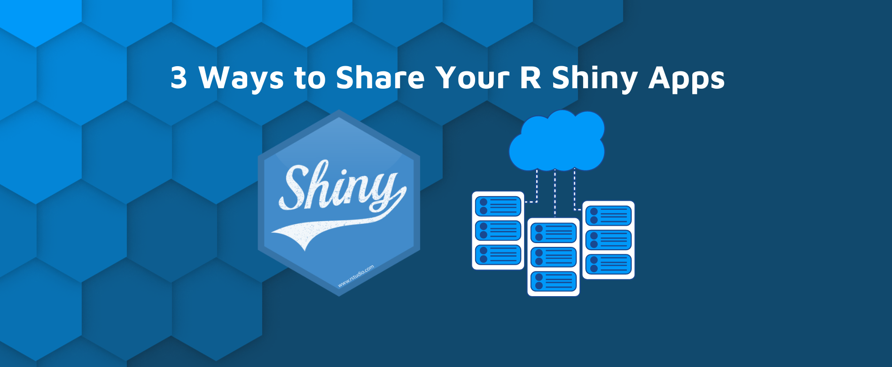
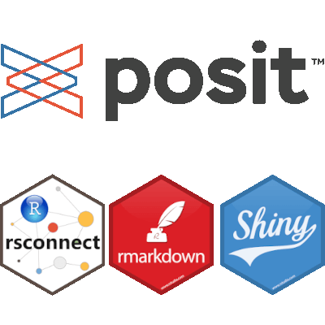
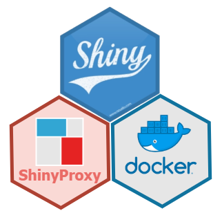

```{r setup, include=FALSE}
# Load packages.
library(fontawesome)

knitr::opts_chunk$set(echo = TRUE)
```


To reap all the advantages of the `riskassessment` application, an organization needs to generate and store results frequently derived from the app, including but not limited to:


{style="float:right; height:140px"}

1. Uploading new packages, & storing their metric info and `riskmetric` score
1. Publishing reviewer comments
1. Submitting package decisions
1. Storing organization-wide metric weights and score-based thresholds for decision automation
1. Credential management for authorized users
1. Etc

To accomplish this, the app uses configuration settings to create and populate several storage solutions locally, in the app's root directory:

* A `SQLite` database named `credentials.sqlite` (by default) for credential management
* A json file named `loggit.json` (by default), recording rudimentary logs of actions performed in the app
* A `SQLite` database named `database.sqlite` (by default) for storing all pkg info, metric info, and comments/ decisions

Note that this article won't cover the credentials database since that's that's been covered (at length) in the ["Credential Manager" guide](../articles/Credential_Manager.html). As you might expect, some deployment environments come with limitations that are not amicable to storage method defined above! Spoiler alert - shinyapps.io is one of them. This article will provide more details about these crucial storage objects and share a run down of the following deployment options with helpful tips:

* shinyapps.io

* RStudio Connect

* Shiny Server

* ShinyProxy

Note! In the future, we'll consider adding utilities that would allow users to connect to an external, or remote storage method (like a database). 

<br>

## Installing vs Forking

Before we discuss deployment methods, we should note that the `{riskassessment}` application is developed using `{renv}` as a form of source control. This helps maintain stability in the code base. While you can install `{riskassessment}` from Github, it is strongly recommended to use a fork of the `{riskassessment}` repository for deployment. This will serve a handful or purposes for your organization:

1. You can utilize `{renv}` in your deployment to help ensure you share the same environment as the app developers, ensuring consistent behavior.
1. You will have easier access to the configuration file allowing for a more streamlined deployment if you have several projects.

<br>

## The `db-config.yml` file

Starting with `{riskassessment} v1.0.0`, a configuration file can be found at `inst/db-config.yml` which is used to initialize the application for deployment. This configuration contains elements vital to app initialization and will only grow as development continues. Many of the elements in the file are also editable from within the application itself (provided your user role has the privileges to do so). Currently, `db-config.yml` contains the following major elements:

* **assessment_db**: A string designating the file path of the assessment SQLite database (will be created upon initialization). It has a default value of `database.sqlite`.
* **credential_db**: A string designating the file path of the credentials SQLite database (will be created upon initialization). It has a default value of `credentials.sqlite`.
* **loggit_json**: A string designating the file path of the logging JSON file (will be created upon initialization). It has a default value of `loggit.json`.
* **credentials**: A list defining user roles and privileges to assigned to those roles in the credentials database.
* **decisions**: A list defining decision categories, automated decision rules (optional), and custom decision category colors (also optional).
* **metric_weights**: A list containing the `{riskmetric}` weights to use upon initialization. These weights are used to increase and decrease the priority of any one metric.


Below is a look at the current default configuration if you were to fork the `{riskassessment}` code today:

<br>

```yml
default:
  assessment_db: database.sqlite
  loggit_json: loggit.json
  credential_db: credentials.sqlite
  credentials:
    roles:
      - admin
      - lead
      - reviewer
    privileges:
      admin: [admin, weight_adjust, auto_decision_adjust, final_decision, revert_decision, add_package, delete_package]
      lead: [weight_adjust, auto_decision_adjust, final_decision, revert_decision, add_package, delete_package]
      reviewer: add_package
  decisions:
    categories:
      - Low Risk
      - Medium Risk
      - High Risk
  metric_weights:
    covr_coverage: 0
```

<br>


### Configuring the assessment database


{style="float:right; height:80px"}

When the `riskassessment::run_app()` function is ran, the code base will check if an assessment sqlite file exists by the name you give it (default is `database.sqlite`) and if it doesn't, [several tables will be initiated](https://github.com/pharmaR/riskassessment/tree/master/inst/sql_queries) to create this database just before the app launches. Note that the user has the authority to name the database file to whatever they like using the `inst/db-config.yml` file. There, you can include a file path preceding the file name if you wish to move the location of the database away from the root directory.  For example, the following code would create a database called "database.sqlite" in the `dev/` folder:

```yml
default:
  assessment_db: ./dev/database.sqlite
```

At the time this vignette was authored, the database will initialize the following tables with all `NULL` values:

* `comments`: stores user comments, including user names associated with each comment entry, comment type, and timestamp
* `community_usage_metrics`: stores CRAN package downloads per month
* `metric`: stores metric info, including the `riskmetric` name, label, short description, type, and weight
* `package_metrics`: stores all package-specific `rismetric` metrics
* `package`: Contains all package information, like name, version, maintainer, etc. It also contains a the `riskmetric` score, the weighted score, decision, and timestamp.


Note: if any changes/ updates occur in these tables with a new release of `riskassessment`, you may need to delete the database file before re-running the app. Any such changes should be announced as 'breaking changes' in the app. If so, remember to save a copy of your current database file in another directory for backup purposes.


<br>


### Database log file config

As mentioned previously, the `loggit.json` file is initiated to track general actions performed in the application, especially those that would reflect a change in the assessment db (`database.sqlite` file). At the time this vignette was authored, here's a summary of actions logged:

* App start up
* User log-ins
* Enabling/ Disabling or changing automated decision rules
* Decisions initiated by users or the decision automation rules, including 
* When pkgs are added or removed from the database, or when there are issues with this process, like when there is an absence of data to that support certain metrics
* Re-weighting pkg metrics
* Any database issues or conflicts that may arise

Each loggit "transaction" recorded contains a lot of info, but most notably, it will contain a time stamp, record type ("info", "warn", or "error"), and a message. For database transactions, the message will usually include the query that was executed. All log entries are always printed out in the R console for your convenience. For example:

```{r, echo=TRUE, eval=FALSE}
riskassessment::run_app()
> [1] "Log file set to loggit.json"
> Listening on http://127.0.0.1:4097
> {"timestamp": "2023-03-20T11:46:23-0400", "log_lvl": "INFO", "log_msg": "User admin signed on as admin"}
> {"timestamp": "2023-03-20T11:46:33-0400", "log_lvl": "INFO", "log_msg": "The following decision rules were implemented by admin (admin): Medium = (0.33__COMMA__ 0.66]; Low = (0__COMMA__ 0.33]; High = (0.66__COMMA__ 1]."}
```


Feel free to use this information as you see fit! Similar to the `assessment_db` parameter in `inst/db-config`, you can name the file whatever you like, and save it in an any directory you'd like. Below, we save it in the `dev/` folder and name it "loggit.json":

```yml
default:
  assessment_db: ./dev/database.sqlite
  loggit_json: ./dev/loggit.json
```

<br>


### Credentials configuration

Similar to the assessment database, when the `riskassessment::run_app()` function executes, the code base will check if an credentials sqlite file exists by the name you give it (default is `credentials.sqlite`) and if it doesn't, `riskassessment` will initiate this new database before the app launches. Note that the user has the authority to name the database sqlite file whatever they desire using `inst/db-config.yml`. There, you can include a file path preceding the file name if you wish to move the location of the database away from the root directory.  For example, the following code would create a database called "credentials.sqlite" in the `dev/` folder:

```yml
default:
  assessment_db: ./dev/database.sqlite
  loggit_json: ./dev/loggit.json
  credential_db: ./dev/credentials.sqlite
```

Right after the **credentials_db** element is used, the **credentials** element (with two sub-elements: **roles** and **privileges**) must be populated. As a guide, below is a snippet of the default values for these elements, but we encourage you to design the configuration that works for you (or your organization).

```yml
credentials:
  roles:
    - admin
    - lead
    - reviewer
  privileges:
    admin: [admin, weight_adjust, auto_decision_adjust, final_decision, revert_decision, add_package, delete_package]
    lead: [weight_adjust, auto_decision_adjust, final_decision, revert_decision, add_package, delete_package]
    reviewer: add_package
```


Note the ["User Roles and Privileges" guide](../articles/User_Roles_and_Privileges.html) is entirely dedicated to this config. For full details, please visit & read that article!

<br>


### Decisions configuration

The **decisions** element contains up to three sub-elements: **categories** (mandatory), **rules**, and **colors**. Here is an example configuration we'll walk through together:


```yml
decisions:
  categories:
      - Insignificant Risk
      - Minor Risk
      - Needs Review
      - Moderate Risk
      - Major Risk
      - Severe Risk
    rules:
      rule_1:
        metric: bugs_status
        condition: ~ metric_score(.x) <= .25
        decision: Severe Risk
      rule_2:
        metric: dependencies
        condition: ~ length(.x) >= 30
        decision: Major Risk
      rule_3:
        metric: has_vignettes
        condition: ~ .x == 0
        decision: Moderate Risk
      Severe Risk:
        - .7
        - 1
      Insignificant Risk:
        - 0
        - .1
      rule_else:
        decision: Needs Review
  colors:
    Moderate Risk: !expr grDevices::rgb(52, 235, 229, maxColorValue = 255)
```

#### Categories

Notice that you can set as many decision `categories` as you wish, but you must specify at least two! It's suggested that the category names you define should be ordinal in some way, where the first category is the lowest risk designation and the last category is the highest risk. In the example configuration above, you can see the categories are defined with a low risk category of "Insignificant Risk" and a high risk category of "Severe Risk". If you have a non-ordinal category you'd like to use, like "Needs Review" for example, that's possible - just don't list it first or last.

#### Rules

Using the `rules` element, you may set up with automated decision rules prior to launching the app. That is, when a package is uploaded, it will automatically get labelled with the appropriate decision when a `rules` condition is met. These rules are executed in order, from top-to-bottom, so it's important to place rules with greatest priority at the top of the list. To implement a decision based on risk score, list the category name and then a mutually exclusive range of values directly beneath it to label those packages whose risk score falls between those two values. Above, we've defined rules that dictate risk scores between 0.7 and 1 should automatically be categorized as "Severe Risk". Similarly, packages scoring between 0 and 0.1 should get labelled "Insignificant Risk".

In addition, the configuration file can evaluate expressions to define rules. To do so, the rule needs three elements: `metric`, `condition`, and `decision` as seen above. The `metric` element is simply the name of the `riskmetric` assessment you'd like to evaluate. Next, provide the R code (including `riskmetric` code) to help define your rules using formula syntax. Note: `.x` will be translated to to the selected `metric`'s assessment value. If you wish to convert this to a metric score, use `riskmetric::metric_score(.x)` as shown above. Last, provide the decision category to apply when this condition is met. Above, we specified hypothetical rules 1 - 3 that apply decisions in this manner; Below, we spell out these expressions in sentence format, taking into account that when the previous condition isn't met:

- packages with a bug closure rate less than 25% should be considered "Severe Risk"
- packages with more than 30 dependencies (and >25% bug close rate) are "Major Risk"
- packages with no vignettes (and <30 dependencies and >25% bug close rate) are"Moderate Risk"

Categories not addressed under the `rules` banner will not receive automated decisions. However, you can provide an optional `rule_else` element to define a decision category to apply to any packages that don't meet the rules above it. Also, keep in mind that users with privileges to edit decision rules may change any of these configuration in the app at a later time.

#### Colors

Last, using the `colors` element you can detail specific colors be assigned to certain categories. Notice that this element will accept an expression to evaluate when launching the application. If you don't care what color is used for a category, then a color-blind friendly color palette is used to fill in those categories not specified. 

<br>


### Metric weights configuration

The **metric_weights** element contains the named list of weights. If a weight is not supplied, it will default to 1. The current list of weights that can be included are the following: has_vignettes, has_news, news_current, has_bug_reports_url, has_website, has_maintainer, has_source_control, export_help, bugs_status, license, covr_coverage, downloads_1yr. As seen above, the default configuration sets the weight for `covr_coverage` to 0. If you want to ignore a certain metric because it has little value to our organization, you could give it a value of zero.

When metrics are not explicitly given here, the app uses the default weight of 1 for each, unless of course there already exists a assessment database previously initialized where those metric weights were manually changed. If you wanted to toggle all current metrics, there is no harm in stating each metric and weight, so you could set up the config file to look like this, for example:

```yml
metric_weights:
  has_vignettes: 2
  has_news: 0.5
  news_current: 2
  has_bug_reports_url: 1
  has_website: 1
  has_maintainer: 1
  has_source_control: 1
  export_help: 2
  bugs_status: 5
  license: 1
  downloads_1yr.: 3
  covr_coverage: 0
```

`{riskmetric}` will use these weights to score your package according to our org's needs!


<br>


## Deployment options

<center>
{style="height:220px"}
</center>

<br>

### shinyapps.io

Beware: shinyapps.io **does not** offer persistent storage of `riskassessment`'s `SQLite` database or logs. Thus, it **is not** likely a viable deployment option for your organization or group. For example, our [demo application](https://rinpharma.shinyapps.io/riskassessment) (hosted on shinyapps.io) contains a pre-prepared database of packages that can't be permanently altered. It CAN be altered within a session, but any changes **will not** persist outside the session.


<br>

### Posit Connect & Shiny Server

{style="float:right; height:160px"}

<br>

On a server, if you want to save files on disk, you'll need to set write permissions accordingly on the folder you want to save the database, logs, and auto-decision json file.

On Posit Connect, you need to use an absolute path to specify the directory where to save the files. You can find more information here: [Persistent Storage on Posit Connect](https://support.rstudio.com/hc/en-us/articles/360007981134-Persistent-Storage-on-RStudio-Connect).

<br>

Beyond that, it's important to note that we strongly encourage those deploying the app to take advantage of the `renv.lock` file used to maintain package version dependencies. For more information on how to use `renv.lock` and our general dev philosophy as it pertains to package management, please read the ["Using `renv`"](https://pharmar.github.io/riskassessment/articles/dev_renv.html) article. Highly related, we encourage the use of git-backed deployment when possible. So, immediately after you update/sync your package dependencies using `renv`, you may want to run `rsconnect::writeManifest()` before deploying from a dedicated branch. For convenience, we maintain a current `manifest.json` that should follow the `renv.lock` file in our GitHub repo. So, if you've forked the application, you should be able to deploy the latest version of the app as-is, directly from our `master` branch. For more information on git-backed deployment & manifest files, please read the Posit article on [git-backed content](https://docs.posit.co/connect/user/git-backed/).

<br>

### ShinyProxy

{style="float:right; height:160px"}

With [ShinyProxy](https://www.shinyproxy.io/), you can use a Docker volume to write files outside of the application container. In `application.yml`, you use can something like this in the specs describing the application:

> container-volumes: [ "/var/log/shinylogs:/root/logs" ]

`/var/log/shinylogs` is a directory on the server where you deploy your applications with ShinyProxy. `/root/logs` is a directory inside your Docker image.


<br>

<br>

<br>

<br>

<br>

<br>


