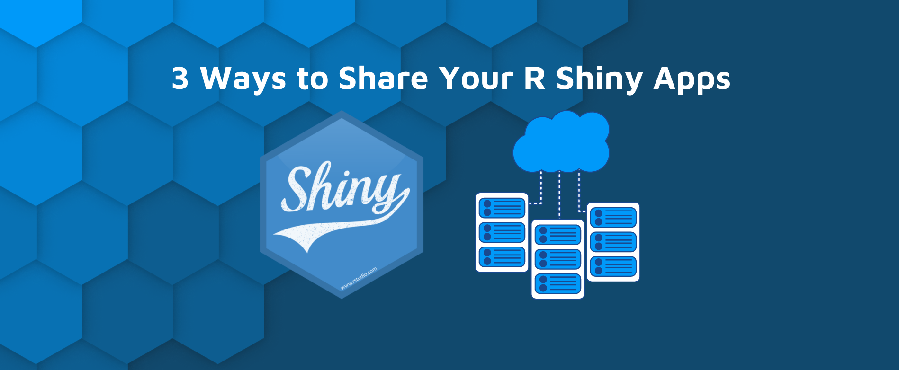
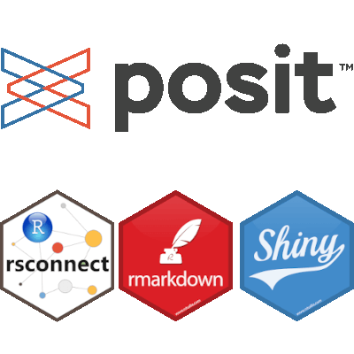

```{r setup, include=FALSE}
# Load packages.
library(fontawesome)

knitr::opts_chunk$set(echo = TRUE)
```


To reap all the advantages of the `riskassessment` application, an organization needs to generate and store results frequently derived from the app, including but not limited to:


{style="float:right; height:140px"}

1. Uploading new packages, & storing their metric info and `riskmetric` score
1. Publishing reviewer comments
1. Submitting package decisions
1. Storing organization-wide metric weights and score-based thresholds for decision automation
1. Credential management for authorized users
1. Etc

To accomplish this, the app automatically creates and populates several storage solutions locally, in the app's root directory:

* A `SQLite` database named `credentials.sqlite` (by default) for credential management
* A `loggit.json`, recording rudimentary logs of actions performed in the app
* A `SQLite` database named `database.sqlite` (by default) for storing all pkg info, metric info, and comments/ decisions
* A `auto_decisions.json` file, that initiates and keeps track of score-based thresholds for decision automation

Note that this article won't cover the credentials database since that's that's been covered (at length) in the ["Administrative Tools and Options" guide](../articles/Administrative_Tools_and_Options.html). As you might expect, some deployment environments come with limitations that are not amicable to storage method defined above! Spoiler alert - shinyapps.io is one of them. This article will provide more details about these crucial storage objects and share a run down of the following deployment options with helpful tips:

* shinyapps.io

* RStudio Connect

* Shiny Server

* ShinyProxy

Note! In the future, we'll consider adding utilities that would allow users to connect to an external, or remote storage method (like a database). 


<br>

## The `database.sqlite` file


{style="float:right; height:80px"}

When the `riskassessment::run_app()` function is ran, the code base will check if the `database.sqlite` file exists, and if it doesn't, [several tables will be initiated](https://github.com/pharmaR/riskassessment/tree/master/inst/app/www/sql_queries) to create this database just before the app launches. Note that the user has the authority to name the database file to whatever they like using the `assessment_db_name` argument in `run_app()`. In addition, you can include a file path here preceding the file name if you wish to move the location of the database away from the root directory.  For example, the following code would create a database called "test_database.sqlite" in the `dev/` folder:

```
run_app(assessment_db_name = './dev/test_database.sqlite')
```

At the time this vignette was authored, the database will initialize the following tables with all `NULL` values:

* `comments`: stores user comments, including user names associated with each comment entry, comment type, and timestamp
* `community_usage_metrics`: stores CRAN package downloads per month
* `metric`: stores metric info, including the `riskmetric` name, label, short description, type, and weight
* `package_metrics`: stores all package-specific `rismetric` metrics
* `package`: Contains all package information, like name, version, maintainer, etc. It also contains a the `riskmetric` score, the weighted score, decision, and timestamp.

There is one exception to this: the `metric` table is populated with data via the [initialize_metric_table.sql](https://github.com/pharmaR/riskassessment/blob/master/inst/app/www/sql_queries/initialize_metric_table.sql) file. If the user deploying the app wants to enter certain weights prior to launching the application, this would be a good place to do it. For example, if your org wants to place a heavier weight on "has_vignettes", then you can increase the `weight` value up accordingly. Of course, you can still do this in the application, but that would require a manual change once the app has launched. Similarly, if you want to ignore a certain metric because it has little value to our organization, you could give it a value of zero here.

Note: if any changes/ updates occur in these tables with a new release of `riskassessment`, you may need to delete the database file before re-running the app. Any such changes should be announced as 'breaking changes' in the app. If so, remember to save a copy of your current database file in another directory for backup purposes.


<br>

## The `loggit.json` file

As mentioned previously, the `loggit.json` file is initiated to track general actions performed in the application, especially those that would impact a change in the `database.sqlite` file. At the time this vignette was authored, here's a summary of actions logged:

* App start up
* User log-ins
* Enabling/ Disabling or changing automated decision rules
* Decisions initiated by users or the decision automation rules, including 
* When pkgs are added or removed from the database, or when there are issues with this process, like when there is an absence of data to that support certain metrics
* Re-weighting pkg metrics
* Any database issues or conflicts that may arise

Each loggit "transaction" recorded contains a lot of info, but most notably, it will contain a timestamp, record type ("info", "warn", or "error"), and a message. For database transactions, the message will usually include the query that was executed. All log entries are always printed out in the R console for your convenience. For example:

```{r, echo=TRUE, eval=FALSE}
riskassessment::run_app()
> [1] "Log file set to loggit.json"
> Listening on http://127.0.0.1:4097
> {"timestamp": "2023-03-20T11:46:23-0400", "log_lvl": "INFO", "log_msg": "User admin signed on as admin"}
> {"timestamp": "2023-03-20T11:46:33-0400", "log_lvl": "INFO", "log_msg": "The following decision rules were implemented by admin (admin): Medium = (0.33__COMMA__ 0.66]; Low = (0__COMMA__ 0.33]; High = (0.66__COMMA__ 1]."}
```


Feel free to use this information as you see fit!


<br>

## The `auto_decisions.json` file

When `riskassessment::run_app()` is executed, a search is performed to see if there exists an `auto_decisions.json` file in the root directory. Without such file, an empty one will be automatically created. This file is used to keep track of any decision automation rules. As you add & edit the rules in the app, the `json` file will update accordingly, keeping track of each categories risk score range. For example, the following json file coordinates with ranges displayed in the app:

```{json, echo=TRUE, eval=FALSE}
{"Medium":[0.33,0.66],"Low":[0,0.33],"High":[0.66,1]}
```

<center>
{style="position:left; width:456px"}
</center>

<br>

## Deployment options

<center>
{style="height:220px"}
</center>

### shinyapps.io

Beware: shinyapps.io **does not** offer persistent storage of `riskassessment`'s `SQLite` database or logs. Thus, it **is not** likely a viable deployment option for your organization or group. For example, our [demo application](https://rinpharma.shinyapps.io/riskassessment) (hosted on shinyapps.io) contains a pre-prepared database of packages that can't be permanently altered. It CAN be altered within a session, but any changes **will not** persist outside the session.


<br>

### Posit Connect & Shiny Server

{style="float:right; height:160px"}

<br>

On a server, if you want to save files on disk, you'll need to set write permissions accordingly on the folder you want to save the database, logs, and auto-decision json file.

On Posit Connect, you need to use an absolute path to specify the directory where to save the files. You can find more information here: [Persistent Storage on Posit Connect](https://support.rstudio.com/hc/en-us/articles/360007981134-Persistent-Storage-on-RStudio-Connect).

<br>

Beyond that, it's important to note that we strongly encourage those deploying the app to take advantage of the `renv.lock` file used to maintain package version dependencies. For more information on how to use `renv.lock` and our general dev philosophy as it pertains to package management, please read the ["Using `renv`"](https://pharmar.github.io/riskassessment/articles/dev_renv.html) article. Highly related, we encourage the use of git-backed deployment when possible. So, immediately after you update/sync your package dependencies using `renv`, you may want to run `rsconnect::writeManifest()` before deploying from a dedicated branch. For more information on git-backed deployment & manifest files, please read the Posit article on [git-backed content](https://docs.posit.co/connect/user/git-backed/).

<br>

### ShinyProxy

{style="float:right; height:160px"}

With [ShinyProxy](https://www.shinyproxy.io/), you can use a Docker volume to write files outside of the application container. In `application.yml`, you use can something like this in the specs describing the application:

> container-volumes: [ "/var/log/shinylogs:/root/logs" ]

`/var/log/shinylogs` is a directory on the server where you deploy your applications with ShinyProxy. `/root/logs` is a directory inside your Docker image.


<br>

<br>

<br>

<br>

<br>

<br>


