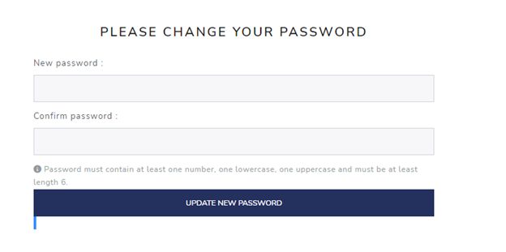
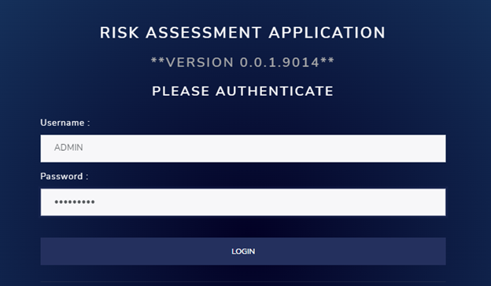
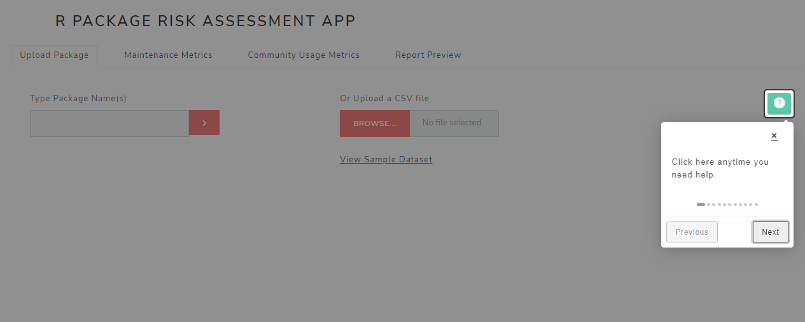
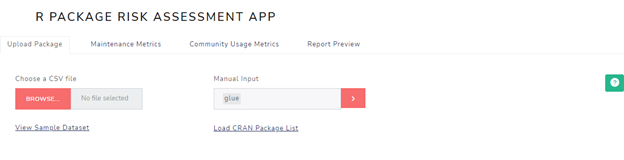
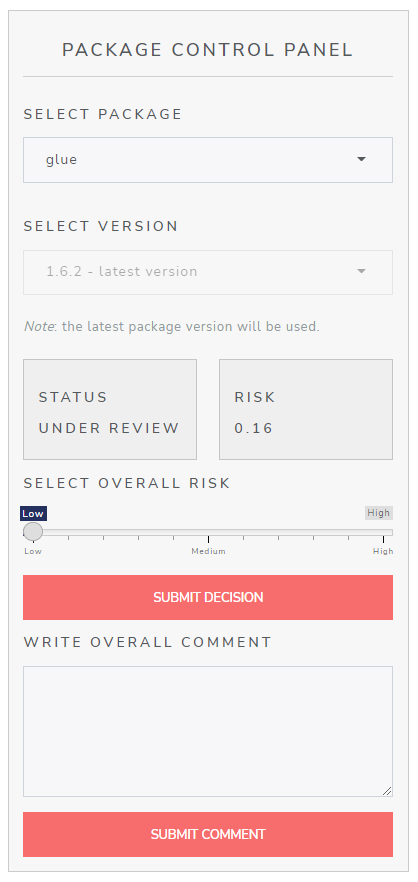
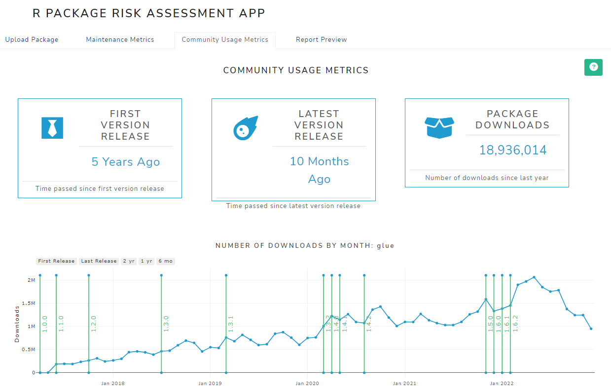
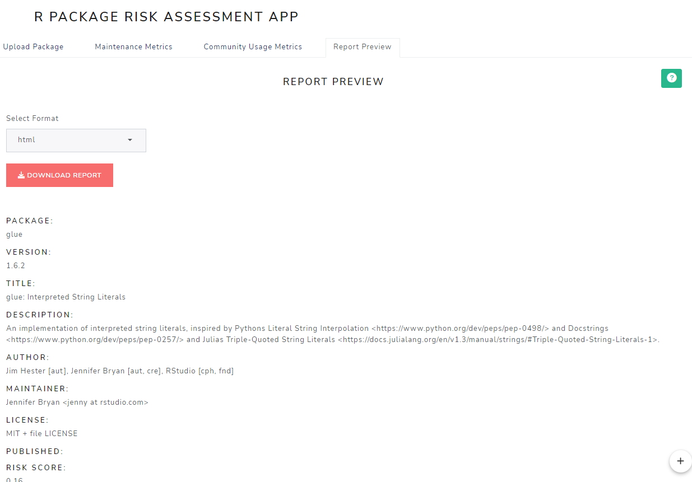

```{r setup, include=FALSE}

knitr::opts_chunk$set(echo = TRUE)
```

## Introduction

This guide will help you get started using the riskmetric package.

We are assuming you are starting with an empty database and and empty credentials file.

## First-time login

After you have instaled the riskmetric package, open it and run:
  
riskassessment::run_app()

The initial login page appears with the note on the bottom:</br>
Note to login for the first time, use the admin userid ADMIN with password QWERTY1.

### Initial login screen
<left>
{width=624px height=424px style="margin: 10px 0 10px 0"}

Once you login for the first time, you will be asked to change your password.</br>
Supply a new password and click on "update new password."

### Update New Password
<left>
{width=624px height=424px style="margin: 10px 0 10px 0"}
</br>
Now click on "login" to re-login.</br>

### re-login
<left>
{width=624px height=424px style="margin: 10px 0 10px 0"}


## Subsequent logins

Now the login note disappears when you use `run_app()`

{width=624px height=424px style="margin: 10px 0 10px 0"}

Or you can use `run_app(pre_auth_user = TRUE)`
which will skip the login page and take you to the main panel.

## Select Help Button

At this point, you should see the Main Panel ("R PACKAGE RISK ASSESSMENT APP")
With four tabs below it.  You should be on the "Upload Package" tab.

Select the help button in the upper right-hand corner, and let it walk you through the “widgets” defined on the main panel and sidebar panel.  

{width=1265px height=506px style="margin: 10px 0 10px 0"}


## Upload a package

Now let's upload some packages to review.

This can be done either manually or by selecting a .csv file you have created.
The .csv file requires two columns: “package” and “version.”</br>
But since the “riskassessment” app always selects the latest version,
you can set version to “0.0.0” for all of your packages.

Here is a simple example of the .csv file:
</br>`package,version`</br>`stringr,0.0.0`</br>`tidyr,0.0.0`

Here, we are going to type in “glue” in the “Manual Input” text box  and select the red “>” button


{width=882px height=414px style="margin: 10px 0 10px 0"}
A progress modal like this one will appear:

{width=382px height=157px style="margin: 10px 0 10px 0"}


Then a “Summary of Uploaded Packages” will display.  This will list the total packages, the number of new packages, the number of undiscovered (probably misspelled) packages, and the number of duplicate packages for the packages just uploaded.

{width=1248px height=248px style="margin: 10px 0 10px 0"}

## Sidebar 

Now go to the “PACKAGE CONTROL PANEL” on the left and select a package.</br>
Note that when you do this, the VERSION and STATUS and RISK boxes are populated,
And the SELECT OVERALL RISK slider, and the SUBMIT DECISION and SUBMIT OVERALL COMMENT 
buttons become available to you.

{width=624px Height=729px style="margin: 10px 0 10px 0"}

## Main Panel Tabs

The “Maintenance Metrics”, “Community Usage Metrics” and “Report Preview” tabs are now available and populated.  

### Maintenance Metrics

Here is a look at the Maintenance Metrics output for the "glue" package:

{width=600px style="margin: 10px 0 10px 0"}
{width=600px style="margin: 10px 0 10px 0"}
</br>Note that you can add or replace comments to the Maintenance Metrics for this package.

### Community Usage Metrics
Here is a look at the Community Usage Metrics for the "glue" package:

{width=600px style="margin: 10px 0 10px 0"}
{width=600px style="margin: 10px 0 10px 0"}
</br>Again, you can add or replace comments to the Community Usage metrics for this package.

### Report Preview

Here is the first part of the Report Preview for the "glue" package:

</br>The report can be downloaded as either an .html, a .docx, or a .pdf file.

{width=624x height=393px style="margin: 10px 0 10px 0"}

## Side Panel Tabs

In the upper left, above “R PACKAGE RISK ASSESSMENT APP” are four tabs.
{width=730px height=53px style="margin: 10px 0 10px 0"}

You are currently in the first tab, “Risk Assessment.”

### database overview

The second tab, “database” shows, for each package loaded, the package name and version, it’s riskassment score, whether a decision has been made, the decision, and last comment provided.  
A report (in either .html, .docx, or .pdf format) can be downloaded for any selected packages.

{width=1376px height=427px style="margin: 10px 0 10px 0"}

### assessment criteria

The third tab, “assessment criteria”, provides a detailed description of the assessment criteria used for Risk Calculation, Maintenance Metrics, Community Usage Metrics, and Testing metrics (not currently used).  The "Risk Calculation" tab is shown below.  Select this tab to for more information.</br>

{width=1272px height=644px style="margin: 10px 0 10px 0"}

### administrative tools

The fourth tab, “administrative tools”, allows administrators to add or delete users as well as change passwords for themselves or other users.  Details will be provided in an “administrative tools” vignette.


## Where to go from here?

Check out some of the riskassessment presentations in [www.pharmar.org](https://www.pharmar.org/present/)

