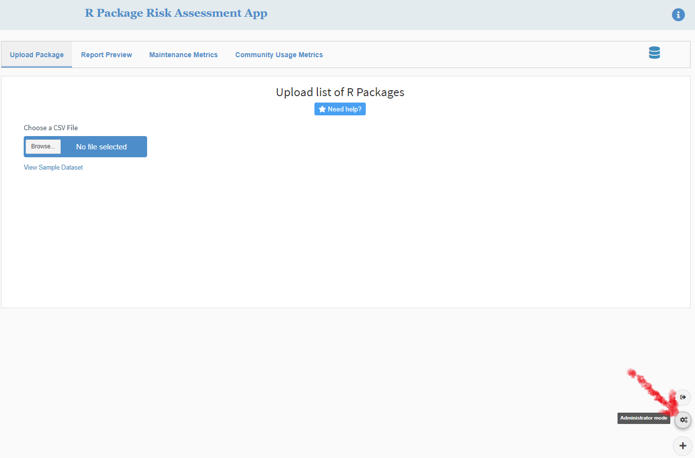
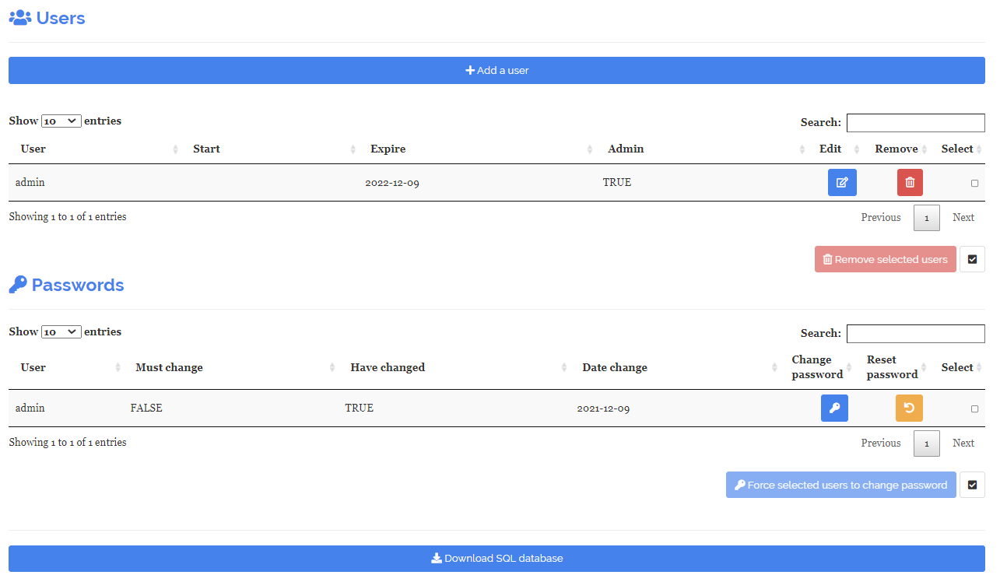
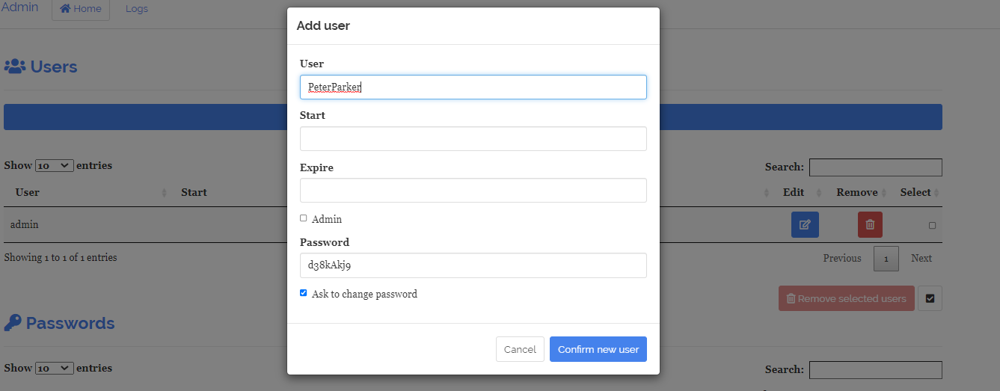
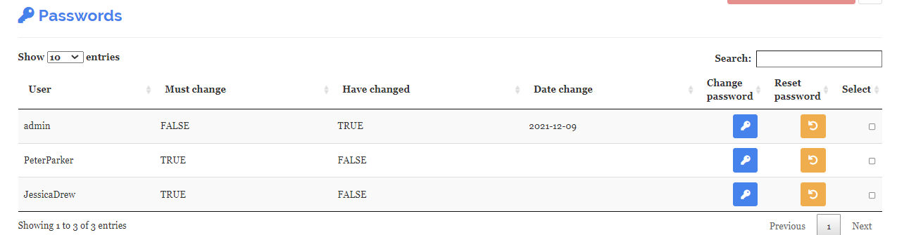

<style type="text/css">
  body{
  font-family: Verdana;
  font-size: 14pt;
}
</style>

```{r setup, include=FALSE}
knitr::opts_chunk$set(echo = TRUE)
```

## Introduction

Creating a protected SQL database with shinymanager::create_db()), 
an admin mode is available to manage access to the application.</br>

The Risk Assessment App is initially set up for one user ("admin") with administrator authority and a default password of "qwerty"

The Starting page of the application will be:</br>
 
 

Note: whenever the credentials database is created, the administrator will be required to create a keyring password.</br>
The following prompt will appear:

 


## First Step for the administrator

The first thing the administrator will need to do is change the **admin** default password of "qwerty"
to something with at least:</br>

- six characters
- one number
- one lowercase character
- one uppercase character

</br>
 


## Next Step -- get into administrator mode 

After successfully changing the password and logging in again, the administrator should next 
click on the "administrator_mode button" on the lower right corner of the dashboard screen</br>
This button will not be displayed for non-administrator users.
 
 
## Administrator Mode

Two tables are presented. </br>
The first is used to manage users, and the second to manage passwords.</br>
 

## Adding users

 Now would be a good time to add users!</br> 
 At the top of the Users table, click "add user"
   

 
 A pop-up screen will appear where you can add the user name and **optional** start and expire dates
 as well as a checkbox to grant administrator authority.  A default password is created and (by default) the user will 
 be required to change it the first time they log in.
 
  
 
 A confirmation message will appear, so you can notify the user and send them the temporary password.</br>
   
   
## start and expire dates

If either the **start** date is set to *after* today's date or the **expire** date is set to *before* today's date,
an "account expired" message will appear, and the login attempt will fail.</br>
As administrator, you can set either or both of these dates or leave them blank for no start or expiration.

   

## Editing and deleting users

The first table allows editing and deleting users.

    

### Edit current user
Edit user information clicking on the blue <a style="color:blue">*edit*</a> button on the table.

### Delete a user
Delete a user by clicking on the red <a style="color:red">*remove*</a> button on the table.

### Notes

- User: You cannot delete or create an existing user
- start & expire: Keep empty for no date restriction
- When adding a new user: by default, a temporary password is generated. But you can replace it with your own password and disable asking user to change it on first log-in.

## Replace yourself?
As an administrator, you can even replace your current user ID with another one.  
Note that **you cannot delete yourself**, so you will need to create another user ID first.</br>
This time, click "add user" and check the admin box.
 
The temporary password can be overridden by un-checking the "ask to change password" box.</br>
Maybe replace the temporary password with something you can remember.
 
    
</br></br>Now sign on to this new administrator user ID and delete the original "admin" user by checking 
the red <a style="color:red">remove"</a> button next to it.


## Password management

The second table allows password management:
    


Click on the blue <a style="color:blue">*Change password*</a> button to force he user to change the password on the next log-in.

Click on the orange <a style="color:orange">*Reset password*</a> button to generate a temporary password.
Please give this to the user.

### Additional information:

- Must change: The user has to change the password next log-in.
- Have changed: The user has already changed the password.
- Date change: Date the password was updated.

