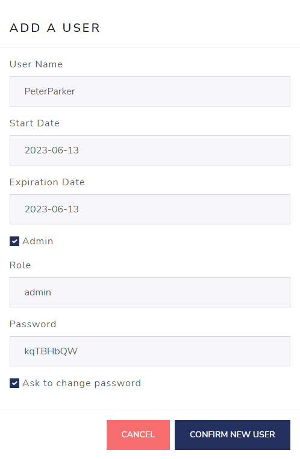

```{r setup, include=FALSE}
# Load packages.
library(fontawesome)

knitr::opts_chunk$set(echo = TRUE)
```

<br><br><br>

## Introduction

This guide is to assist admins manage user IDs and passwords for the Risk Assessment App. 


### Default user

The first time you login, you will have used 
the admin user ID: <u>ADMIN</u> with password <u>QWERTY1</u>.
and will have have changed your password by now.


## Administrative Tools 

Only users with administrator privileges have access to the Administrative Tools and Options section. To verify you have access to  this, first verify that you can see all four navigation tabs at the top of the app, with the rightmost 
one showing "Administrative Tools".

<left>

{style="margin: 10px 0 10px 0"}

<left>

You can also hover your cursor over the xmark `r fa("xmark")` symbol in the bottom-right corner of the app. Upon hovering, two additional buttons should appear. The middle one is the logout `r fa("right-from-bracket")` button,  while the Administrator mode `r fa("gears")` button will appear on top, as seen below.  This button will not appear from non-admin users.

<center>

{width=750px style="margin: 10px 0 10px 0"}

</center>


<br>

Once you have entered this section,
you should see two tabs here:  The first is "Credential Manager" and the second is "Assessment Reweighting."

</br>
We will cover the "Credential Manager" tab first.

### Credential Manager tab

Two tables are presented. The first one, indicated by the `r fa("users")` Users icon, is used to manage users.
</br>The the second one, indicated by the `r fa("key")` key icon, is used to manage passwords.

<center>

{width=750px}

</center>

## Managing Users
<br> 

Given the only user ID at the moment is "ADMIN", this would be a good time to add some users. At the top of the **Users** table, click the dark blue button labelled: "Add a user".
 
<center>

{width=142px}

</center>

<br>

A prompt will appear where you can specify a user name and **optional** start & expire dates which by default are set at today's date (more on those later). A check box to grant the new user administrator authority is also checked by default. A custom password is generated which will require changing the first time the new user logs in, if the "Ask to change password" box is left checked. Here, we'll type "PeterParker" into the User name field.
 
<center>

{width=750px}

</center>

<br>

Upon submission, a confirmation message will appear, so you can notify the user and send them his/her temporary password.</br>
 
<left>


## User `start` and `expire` dates

If either the **start** date is set to a future date or the **expire** date is set to *before* today's date, an "account expired" message will appear, and the log in attempt will fail.  See image below.

<br>

As an administrator, you can set either or both of these dates or just leave
them blank.

<left>

{width=400px}

</left>

<br>

## Managing users

The first table allows adding, editing, and deleting users.

<center>

{width=750px}

</center>

<br>

### Edit current user


Edit a user information by clicking on the blue `r fa(name = "pen-to-square", fill = "blue", height = "2em")` <a style="color:blue">Edit</a> button, found on the right-hand side of the table.

<br>

### Delete a user


Delete any user by clicking on the red `r fa(name = "trash-can", fill = "red", height = "2em")` <a style="color:red">Remove</a> button, also on the right-hand side of the table.


## Replace initial `Admin` user

As an administrator, it's recommended you replace your initial `admin` user ID with one unique to you. Note that there must always be **at least** one admin user, and **you cannot delete yourself!**  If you want to delete the initial `admin` user you will first need to create another user ID first with administrative privileges, as described below.


Click the blue "Add a user" button and make sure to check the `Admin` box. The temporary password can be overridden by un-checking the "ask to change password" box.

<br>

<center>

 
</center>

<br>

After completing the form, sign in using your new credentials and delete the original `admin` user by clicking the red <a style="color:red">remove</a> button.

<br>


## Password management

The second table allows for password management.

<center>

 

</center>

Click on the blue <a style="color:blue">*Change password*</a> button to force
corresponding user to change his/her password on the next log-in.

Click on the orange <a style="color:orange">*Reset password*</a> button to generate a temporary password. You are responsible for delivering the new password to the user.

<br>

### Additional column definitions

- Must change column: Indicates whether the user has to change his/her password
next log-in.
- Have changed column: Indicates the user has already changed his/her password.
- Date change column: Indicates the date the password was updated.

<br>

## Have an issue?

That's all for this tutorial. If you have any issues or feature requests as it pertains to managing user IDs and passwords in the app, please open a new issue on our [Github repo](https://github.com/pharmaR/riskassessment/issues). 


<br>

<br>

<br>

<br>
