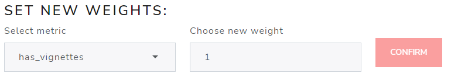

```{r setup, include=FALSE}
# Load packages.
library(fontawesome)

knitr::opts_chunk$set(echo = TRUE)
```

</br></br></br>

Starting with Version 2.0.0, there has been a major overhaul on how privileges function within the application. Privileges are now tied to user roles! This allows additional flexibility to manage a user's access. While privileges are tied to the application itself, user roles can be configured. For purposes of discussion, the default configuration will be used as reference in this vignette. For more information see [Deployment](Deployment.html).

# Privileges

Currently, there are six different privileges that can be tied to user roles:

* Administrator: manages the users of the application
* Weight Adjustment: manages the weights applied to the `{riskmetric}` risk calculation
* Automated Decision Adjustment: manages the decision automation rules and decision category display colors
* Final Decision: makes final decisions regarding packages
* Revert Decision: can undo a final decisions made regarding packages
* Add Packages: adds packages for consideration
* Delete Packages: can remove packages from consideration

### Administrator

The `admin` privilege is discussed at length in [Administrative Tools and Options](Administrative_Tools_and_Options.html). Please reference that vignette for more information.

### Weight Adjustment

The `weight_adjust` privilege allows a user to change the weights applied to the `{riskmetric}` risk calculation. These options can be found under `Assessment Reweighting` in the `Administrative Tools` tab. Here is a high level view:

{style="position:center; width:800px"}

</br></br>There are three buttons on this page: <a style="color:red">**UPDATE WEIGHT**</a> on the top right, <a style="color:red">**DOWNLOAD**</a> on the middle left, and <a style="color:red">**RE-CALCULATE**</a> on the bottom left. 

<br>

## Download Database

First, the simplest: the <a style="color:red">**DOWNLOAD**</a> database button.

<br>

<center>
{style="position:center; width:392px"}
</center>

<br>

When clicked, this button will download a copy of the current database (by default, called "database.sqlite"). The app developers recommend doing this anytime you plan to make integral changes to the database (like changing metric weights), before anything else.

<br>

## Updating Weights

As the name suggests, this modules allows to us view existing and change metric weights used to calculate a risk score using `riskmemtric`.

<br>

<center>
{style="position:center; width:812px"}
</center>

<br>

</br>Here you can either select a metric from the `Select metric` dropdown box or select a row </br>in the "CURRENT RISK SCORE WEIGHTS BY METRIC" table.

Once the metric is selected, enter a new (numeric) weight in the "Choose new weight" box and select the <a style="color:red">**UPDATE WEIGHT**</a> button. You'll notice the row with the change will appear highlighted, showing you the old weight value and the new weight value:

<br>

<center>
{style="position:center; width:540px"}
</center>

<br>

After you have updated **at least one** metric weight, the <a style="color:red">**RE-CALCULATE**</a> button is enabled, allowing you to apply new weights and re-calculated the risk for each package.</br>

After you've made all final re-weighting changes, you can click the "Re-calculate" button pictured here. Note that these weight changes will take effect on all packages in the database, updating the risk score for each.

<br>

<center>
{style="position:center; width:481px"}
</center>

<br>

</br></br>Once you click on <a style="color:red">**RE-CALCULATE**</a> you will get a confirmation modal, reminding you that "updating the risk metrics cannot be reverted", and strongly recommending you download a copy of the current database first before clicking on <a style="color:red">**SUBMIT**</a>. The modal also details all the actions that will take effect in the app if you submit these changes.

<br>

<center>
{style="position:center; width:654px"}
</center>

<br>

Once you click on <a style="color:red">**SUBMIT**</a> a modal dialog box will appear indicating
that it is applying weights and updating risk scores to each package you have uploaded. This will be followed by a brief "updates completed" message.

<br>

<center>
{style="position:center; width:373px"}
</center>

<br>

Now go to the database overview tab to confirm that the risk scores have been updated. You can also view the new weights, including the standardized weight on the `Assessment Criteria` tab.

