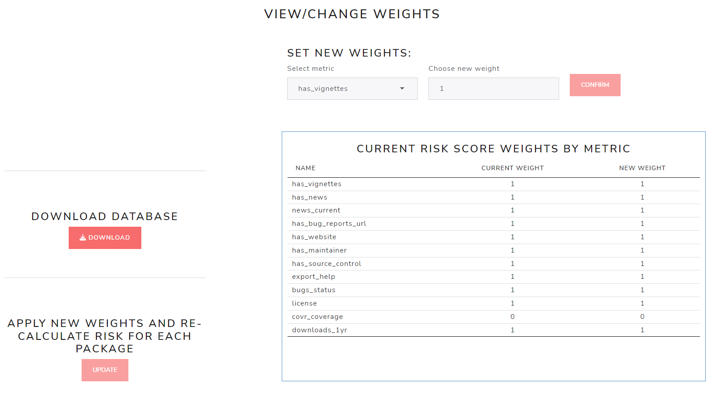

```{r setup, include=FALSE}
# Load packages.
library(fontawesome)

knitr::opts_chunk$set(echo = TRUE)
```

</br></br></br>

Starting with version 1.0.0, there has been a major overhaul on how privileges function within the application. Privileges are now tied to a user's role, and the person responsible for deploying the application can create custom roles, compiled with any combination of privileges! These user-defined roles allows the most flexibility to manage a user's access & ability in the app. For purposes of discussion, the default configuration will be used as reference. For more information see the ["Deployment" guide](../articles/Deployment.html).

Below is a snippet from the `inst/db-config.yml` file where the default roles are defined with privileges we'll discuss in this article:

<br>

```yml
privileges:
  admin: [admin, weight_adjust, auto_decision_adjust, final_decision, revert_decision, add_package, delete_package, overall_comment, general_comment]
  lead: [weight_adjust, auto_decision_adjust, final_decision, revert_decision, add_package, delete_package, overall_comment, general_comment]
  reviewer: [add_package, general_comment]
  viewer:
```
<br>

# Privileges

At the time this vignette was authored, there are six different privileges that can be assigned to a role:

* [Administrator](User_Roles_and_Privileges.html#administrator) (`admin`): manages the users of the application
* [Weight Adjustment](User_Roles_and_Privileges.html#weight-adjustment) (`weight_adjust`): manages the weights applied to the `{riskmetric}` risk calculation
* [Automated Decision Adjustment](User_Roles_and_Privileges.html#automated-decision-adjustment) (`auto_decision_adjust`): manages the decision automation rules and decision category display colors
* [Final Decision](User_Roles_and_Privileges.html#final-decision) (`final_decision`): makes final decisions regarding packages
* [Revert Decision](User_Roles_and_Privileges.html#revert-decision) (`revert_decision`): can undo a final decisions made regarding packages
* [Add Packages](User_Roles_and_Privileges.html#add-packages) (`add_package`): adds packages for consideration
* [Delete Packages](User_Roles_and_Privileges.html#delete-packages) (`delete_package`): can remove packages from consideration
* [Overall Commentator](User_Roles_and_Privileges.html#overall-commentator) (`overall_comment`): can add/edit the overall comment and summary for a package
* [General Commentator](User_Roles_and_Privileges.html#general-commentator) (`general_comment`): can add maintenance and community metric comments

### Administrator

Basically, the `admin` privilege includes all the privileges discussed below, plus the ability to manage credentials. The credential-heavy features of the `admin` privilege are discussed at length in ["Credential Manager" guide](../articles/Credential_Manager.html). Please reference that vignette for more information.

<font size="2">[return to top](User_Roles_and_Privileges.html)</font>

### Weight Adjustment

The `weight_adjust` privilege allows a user to change the weights applied to the `{riskmetric}` risk calculation. These options can be found under `Assessment Reweighting` in the `Administrative Tools` tab. Here is a high level view:

{style="position:center; width:800px"}

</br></br>There are three buttons on this page: <a style="color:red">**CONFIRM**</a> on the top right, <a style="color:red">**DOWNLOAD**</a> on the middle left, and <a style="color:red">**UPDATE**</a> on the bottom left. 

<br>

#### Download Database

First, the simplest: the <a style="color:red">**DOWNLOAD**</a> database button.

<br>

<center>
{style="position:center; width:392px"}
</center>

<br>

When clicked, this button will download a copy of the current database (by default, called "database.sqlite"). The app developers recommend doing this anytime you plan to make integral changes to the database (like changing metric weights), before anything else.

<br>

#### Updating Weights

The <a style="color:red">**CONFIRM**</a> button allows you to view existing and change metric weights used to calculate a risk score using `riskmemtric`.

<br>

<center>
{style="position:center; width:812px"}
</center>

<br>

</br>Here you can either select a metric from the `Select metric` dropdown box or select a row </br>in the "CURRENT RISK SCORE WEIGHTS BY METRIC" table.

Once the metric is selected, enter a new (numeric) weight in the "Choose new weight" box and click the <a style="color:red">**CONFIRM**</a> button. You'll notice the row with the change will appear highlighted, showing you the old weight value and the new weight value:

<br>

<center>
{style="position:center; width:540px"}
</center>

<br>

After you have updated **at least one** metric weight, the <a style="color:red">**UPDATE**</a> button is enabled, allowing you to apply new weights and re-calculated the risk for each package.</br>

After you've made all final re-weighting changes, you can click the "Update" button pictured here. Note that these weight changes will take effect on all packages in the database, updating the risk score for each.

<br>

<center>
{style="position:center; width:481px"}
</center>

<br>

</br></br>Once you click on <a style="color:red">**UPDATE**</a> you will get a confirmation modal, reminding you that "updating the risk metrics cannot be reverted", and strongly recommending you download a copy of the current database first before clicking on <a style="color:red">**SUBMIT**</a>. The modal also details all the actions that will take effect in the app if you submit these changes. Note that starting with Version 1.0.0, this will be a re-calculation on the stored `{riskmetric}` assessments, not a re-assessment.

<br>

<center>
{style="position:center; width:654px"}
</center>

<br>

Once you click on <a style="color:red">**SUBMIT**</a> a modal dialog box will appear indicating
that it is applying weights and updating risk scores to each package you have uploaded. This will be followed by a brief "updates completed" message.

<br>

<center>
{style="position:center; width:373px"}
</center>

<br>

Now go to the database overview tab to confirm that the risk scores have been updated. You can also view the new weights, including the standardized weight on the `Assessment Criteria` tab.

<font size="2">[return to top](User_Roles_and_Privileges.html)</font>

### Automated Decision Adjustment

Users with the `auto_decision_adjust` privilege can edit decision automation rules and decision category colors. If your organization has black and white rules about package risk decisions based solely on  `riskmetric` scores, then decision automation is for you. When leveraged, it will help you automatically classify packages into the "Low Risk", "Medium Risk", or "High Risk"  decision categories upon upload (for the default configuration). The current automation rules are accessible in two locations: under 'Upload Package' in the `Risk Assessment` tab & under 'Decision Categories' in the `Database` tab. To get started, click on the small `r fa("gear", fill = "red", height = "1em")` (gear) button in the upper right hand corner of either section.


<br>

<center>
{style="margin: 10px 0 10px 0"}
</center>

<br>

Clicking on the `r fa("gear", fill = "red", height = "1em")` (gear) button will open a modal with two sections: "Select Category Colors" and "Automate Decisions by Risk Score".
<center>
{style="margin: 10px 0 10px 0"}
</center>

#### Select Category Colors

To change the color for one of your decision categories, select a new color by either typing in the desired hexidecimal code or use the color input.

<center>
{style="margin: 10px 0 10px 0"}
</center>

<br>

To apply these changes, click <a style="color:red">**APPLY COLORS**</a>. A pop-up will ask the user to review and confirm the selection:

<center>
{style="margin: 10px 0 10px 0"}
</center>

The modal contains a summary of all decision categories with their respective new colors. If you are happy with your selections, simply click <a style="color:red">**SUBMIT**</a> and the database and application will be updated with your selections.

#### Automate Decision by Risk Score

If there are no decision rules applied, you'll see the following decision categories adjacent empty check boxes. When setting up these rules for your organization, you can choose as much or as little automation as desired. 

<br>

<center>
{style="margin: 10px 0 10px 0"}
</center>

<br>

For example, if you want to set up an automatic decision for "High Risk" scores, you only need to select that check box and make your risk score designation / cut off value. From then on, every time a package is uploaded with a risk score > 0.67, it will automatically receive the decision label: "High Risk" which saves your review team time and mental capacity when reviewing large groups of packages.

<br>

<center>
{style="margin: 10px 0 10px 0"}
</center>

<br>

Similarly, if you have package risk thresholds mapped out for each decision category, then apply them here! The user interface won't allow the slider ranges to overlap, but it will allow gaps between each range. In the example below, we adopt automatic decisions for packages with risk scores less than 0.33 and greater than .67. In this fictitious example, let's say our organization has a policy that any package whose risk score falls between 0.33 and 0.67 will need to be reviewed manually. 

<br>

<center>
{style="margin: 10px 0 10px 0"}
</center>

<br>

To apply these changes, click <a style="color:red">**APPLY DECISION RULES**</a>. A pop-up will ask the user to review and confirm the selected automation rules:

<br>

<center>
{style="margin: 10px 0 10px 0"}
</center>

<br>

Upon clicking submit, the automation rules will be stored for all users to see on the 'Upload Package' tab. After uploading a new set of packages, you can see the 'Summary of Uploaded Package(s)' now includes a summary of decisions made and each category it was automatically assigned. In the example below, you can see that 10 packages were uploaded, and 7 automatic decisions were made: six received the "low risk" designation and one was labeled as "high risk". In the summary table, you can note the risk score and decision on the right-hand side. You can also observe that a few packages weren't found because they don't exist on CRAN.

<br>

<center>
{style="margin: 10px 0 10px 0"}
</center>

<br>

In the 'PACKAGE CONTROL PANEL', if we select one of the packages where a decision was made, you will see that the 'Status' has been changed to "Reviewed" and the risk decision slider has been adjusted accordingly and disabled. In addition, an 'Overall Comment' was submitted, stating that the decision made was driven via the automation rules.


<br>

<center>
{style="margin: 10px 0 10px 0"}
</center>

<font size="2">[return to top](User_Roles_and_Privileges.html)</font>


### Final Decision

As the name suggests, a user with the `final_decision` privilege can make final decisions as to which category a package should be assigned. Overall comments regarding the package are also tied to this privilege.

<br>

<center>

</center>

<font size="2">[return to top](User_Roles_and_Privileges.html)</font>


### Revert Decision

A user with the `revert_decision` privilege can undo a final decision after it has been made. Doing so will set the package's status to "under review" and will re-enable "overall comments" regarding the decision.

<center>

</center>

<font size="2">[return to top](User_Roles_and_Privileges.html)</font>


### Add Packages

A user with the `add_package` privilege can upload packages to the database for consideration.

<center>

</center>

<font size="2">[return to top](User_Roles_and_Privileges.html)</font>


### Delete Packages

A user with the `delete_package` privilege can remove packages from consideration (the database).

<center>

</center>

<font size="2">[return to top](User_Roles_and_Privileges.html)</font>

### Overall Commentator

A user with the `overall_comment` privilege can add/edit the overall comment and summary of a package.

<font size="2">[return to top](User_Roles_and_Privileges.html)</font>

### General Commentator

A user with the `general_comment` privilege can add comments regarding the maintenance and community metrics of a package.

<font size="2">[return to top](User_Roles_and_Privileges.html)</font>


<br>

<br>

# Roles

User roles group select privileges together providing users with different, but not necessarily mutually exclusive, access to the application. The default configuration contains four user roles: **admin**, **lead**, **reviewer**, **viewer**. Here is a snippet from the `inst/db-config.yml` file where these roles are defined:

<br>

```yml
privileges:
  admin: [admin, weight_adjust, auto_decision_adjust, final_decision, revert_decision, add_package, delete_package, overall_comment, general_comment]
  lead: [weight_adjust, auto_decision_adjust, final_decision, revert_decision, add_package, delete_package, overall_comment, general_comment]
  reviewer: [add_package, general_comment]
  viewer:
```
<br>

In this configuration, an **admin** user has access to the entire application, a **lead** user has access to all privileges except administrative ones (e.g. managing user credentials), a **reviewer** only has the privilege to add packages for consideration and adding comments/descriptions, and a **viewer** can only view the current state of assessment. An organization can customize these user roles to support their needs. For more information please reference the ["Deployment" guide](../articles/Deployment.html).

<font size="2">[return to top](User_Roles_and_Privileges.html)</font>

<br>

<br>

<br>

<br>

<br>

<br>

<br>

<br>


