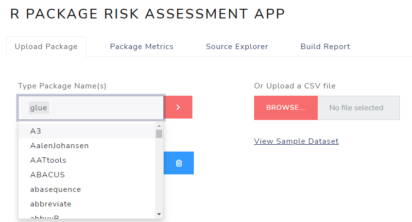

```{r setup, include=FALSE}

knitr::opts_chunk$set(echo = TRUE)
```


## Introduction

Welcome! This guide will help users get started with the `riskassessment` application for the first time. For more information about how to deploy the application, please reference the `Deployments` [INSERT LINK] guide. And note: this guide assumes you have already downloaded the `riskassessment` package & all of it's dependencies following the [installation instructions](../index.html#installation).

<br>

## Run / Deploy `app.R`

If your application is already deployed, you can skip this step! After you have [installed](../index.html#installation) the `riskassessment` package, you are now able to run the app locally using the [provided](https://github.com/pharmaR/riskassessment/blob/master/app.R) `app.R` file. If applicable, you can specify application options in this file, using either `options()` or arguments of the `run_app()` function (run `?riskassessment::run_app` to learn more). However, for the purposes of this guide, we'll run the function as-is, accepting all defaults:

```{r app.R, echo=TRUE, eval=FALSE}
# launch the application
riskassessment::run_app()
```

Running this code will launch the application and if it doesn't already exist, it will create an initial database for authentication.

<br>


## First time log in

The first page you'll see is an authentication screen with a default note on the bottom: </br><b> NOTE: TO LOG IN FOR THE FIRST TIME, USE THE ADMIN USER: <u>ADMIN</u> WITH PASSWORD <u>QWERTY1</u>.</b> If you recall, the application acts as a central hub for an organization to review and assess the risk of R packages, thus establishing users with specific roles is vital. To start, the application needs an `admin` user.

<br>

<center>
{style="margin: 10px 0 10px 0"}
</center>

<br>

This `admin` user will be asked to change their password immediately. After supplying a new secure password, click "UPDATE NEW PASSWORD". When the password was successfully updated, you'll be prompted to "LOGIN" again with your new credentials.

<br>

<center>
{style="margin: 10px 0 10px 0"}
</center>

<br>


## Subsequent logins

The designated `admin` user(s) will have special privileges and duties in the application, including but not limited to creating new users, with both `admin` and non-admin roles. For `admin`s, please see the article titled ["Credential Manager"](../articles/Credential_Manager.html) on how to create these new users. For non-admin roles, you will receive a temporary password for your initial log in, which you'll be prompted to change with immediately upon your first visit to the app. For subsequent visits, you won't have to worry about all these first-time log in procedures!


<br>


## Welcome to the app!

Upon successful log in, you'll notice many tabs and panels. 
<br>

{style="margin: 10px 0 10px 0"}

<br>


### Self-guided tours

Throughout the app, there are small help buttons strategically placed in the upper right-hand corners of each page. When clicked, they empower users to walk through all the UI elements visible on-screen at their desired pace. Consider it your personal tour guide when you need a quick reminder on "what does what?".

<center>


{style="margin: 10px 0 10px 0"}

<br>

</center>

## Upload a package

Now to the main event - let's upload some packages to review & assess for our organization. If it's your first time using the app, an empty database will be initialized on app launch to be populated with packages, their `riskmetric` outputs, and your organization's assessment preferences. To begin filling the database with package info, we'll need to start by upload a list of packages we want to review. Under the `Risk Assessment` tab, the main panel is titled, `R PACKAGE RISK ASSESSMENT APP` with four tabs under it. By default, you'll be directed to the `Upload Package` tab. 


Uploading packages can be done by manually typing one (or more) package names into the prompt or, if you have a long list of packages to asses, it may be more convenient to upload a CSV file of the package names. The CSV file requires two columns: “package” and “version.” However, right now `riskmetric` can only tackle the current version, so the version column is ignored. In the meantime, you can make your life easier by setting version to “0.0.0” for all of your packages in the CSV. Additionally, a third column "decision" can be included. This can be helpful if your organization already has a list of packages approved for use.

A over simplified example of an acceptable CSV file:
```
package,version
stringr,0.0.0
tidyr,0.0.0
```

Alternatively, you may prefer to test the app by typing in a package, such as “glue” into the prompt. Notice that the text input will pre-populate itself with all CRAN packages upon click, thus if you forget the spelling or case of the package, the auto-complete feature can assist your. When ready, select the red “>” button

<center>
{style="margin: 10px 0 10px 0"}
</center>

A progress modal like the one below will appear indicating the process of generating package info  from various sources has begun and the app will start inserting this information into the database.

<center>
{width=382px height=157px style="margin: 10px 0 10px 0"}
</center>

Upon completion, a “Summary of Uploaded Packages” section will display.  This lists the total packages uploaded, the number of packages that were new to the database, the number of undiscovered (probably misspelled) packages, and the number of duplicate packages, i.e. packages that already existed in the database. 

<center>
{style="margin: 10px 0 10px 0"}
</center>

<br>

## Decision Automation

If your organization has black and white rules about package risk decisions based solely on  `riskmetric` scores, then decision automation is for you. When leveraged, it will help you automatically classify packages into the "Low", "Medium", or "High" risk decision categories upon upload. This automation saves your review team time and mental capacity when reviewing large groups of packages. The current automation rules are always displayed on the 'Upload Package' tab. Please note that only `admin` users have the necessary privileges to edit. To get started, click on the small gear button in the upper left hand corner


<br>

<center>
{style="margin: 10px 0 10px 0"}
</center>


<br>

In a fictitious example below, let's say an `admin` user adopts automated decision rules for packages with risk scores less than 0.33 and greater than .66. Perhaps this organization has a policy that mandates any package whose risk score falls between 0.33 and 0.66 will need to be reviewed manually. After uploading a new CSV of packages, you can see the 'Summary of Uploaded Package(s)' displays the number of decisions made overall and by each risk category. Here, you can see that 10 packages were uploaded, and 5 automatic decisions were made: four received the "low" designation and one was labeled as "high" risk. In the summary table, the decisions are displayed with their respective risk scores on the right-hand side. You can also observe that a few packages weren't found because they don't exist on CRAN.

<br>

<center>
{style="margin: 10px 0 10px 0"}
</center>


<br>

## Sidebar 

Now that the database has been populated with package data, direct your attention to the `PACKAGE CONTROL PANEL` at left and select a package (such as `glue`) from the list. Once a package is selected, the `VERSION`, `STATUS` and `RISK` boxes are populated with information. For now, the latest version of the package is displayed. Since a decision to endorse or reject the package hasn't been made yet, the `STATUS` is "Under Review". Third, the `RISK` box contains the `riskmetric` score, represented as a number between 0 (low risk) and 1 (high risk).

<center>
{style="margin: 10px 0 10px 0"}
</center>

There are also two submission buttons above: `SUBMIT DECISION` and `SUBMIT OVERALL COMMENT`. The goal is that after a thorough review of other info contain in the application, the user would be well informed enough to categorize the package's risk as either "low", "medium", or "high" risk using the slider. Clicking submit here completes the review of this package for the organization and can only be undone by an `admin` user. If you're looking submit something less formal, before submitting a decision, consider submitting an "overall comment" summarizing your high level thoughts on the package. Though it's not required, it's recommended to always submit an "overall comment" when submitting a final decision.

<br>


## 'Package Metrics' Review Tabs

The `Package Metrics` tab contains all the `{riskmetric}` derived assessments in one place, and consolidates them into different like-kind groups for convenience-sake. That is, metrics are sorted into either "Maintenance" or "Community Usage" categories. As of the latest version of the app, a 3rd category was added to better support the analysis of "Dependencies", all of which can be selected via the drop down at the top of the tab:


<center>
{style="margin: 10px 0 10px 0"}
</center>


It's on these tabs that the bulk of the more automated review occurs because each metric provides the context that determines the final `riskmetric` score. We highly encourage users to become very familiar with these metrics and decide which are most important to you and your organization. As is available in `riskmetric`, `riskassessment` allows `admin` users to set organization-wide metric weights so that the risk score is based on the most meaningful metrics, and reduces the influence of less important metrics. Thus, if a metric is un-important to your org, we highly recommend weighting it to 0. To learn more about these options, please read through our ["Metric weights configuration" guide](../articles/Deployment.html#metric-weights-configuration).

<br>


### Maintenance Metrics

Here is a look at the Maintenance Metrics output for the "glue" package:

<center>
{style="margin: 10px 0 10px 0"}
</center>

Each metric on this tab measures something related to package maintenance best practices, whether it be storing the code on a public URL, providing vignettes to guide users, or package authors sufficiently giving attention to bugs. Note that some of the metrics will report that an assessment is "Not Found". That's because this application uses the "pkg_cran_remote" source when compiling metrics, which does not have the capability to gather info for all possible metrics. There is a [on-going effort](https://github.com/pharmaR/riskmetric/issues/299) to build out more more information on these remote metrics. To learn more, please explore more package assessment topics in the [riskmetric documentation](https://pharmar.github.io/riskmetric/reference/index.html).


Note that you can add or replace comments to the Maintenance Metrics for this package, and review paste comments made by other users. This is a great platform to not only form your opinions, but write them down for others in your organization to read and consider during their evaluation.

<center>
{style="margin: 10px 0 10px 0"}
<center>

<br>


### Community Usage Metrics
Here is a first look at the Community Usage Metrics for the "glue" package:

<br>

<center>
{style="margin: 10px 0 10px 0"}
</center>

<br>

Each metric on this tab measures something related to the package's usage by the community. The user community plays an important role in open source software development. In other words, the more exposure a package has had to the community, the more ad-hoc testing it has been exposed to. Over time the "better packages" tend to rise to the top, leading to more downloads and increased exposure. Note that `riskmetric` only considers the metric called `Number of download in the last year` and `Reverse Dependencies` for its risk score calculation. All the other data presented on this tab are accessories to help the user further explore the idea of community usage.

Notably, this tab includes a highly interactive visual, which shows the number of downloads by month since the package was first released. For more information on these metrics, explore package assessments in the [riskmetric documentation](https://pharmar.github.io/riskmetric/reference/index.html).


Again, you can add or replace comments to the Community Usage metrics for this package.

<center>
{style="margin: 10px 0 10px 0"}
</center>

<br>


## The 'Source Explorer' Tab

Introduced in v2.0.0 of `riskassessment`, the `Source Explorer` tab offers users a more manual, hands-on approach to assessing packages by exploring the source contents of a package. Just as if you were a developer forking a repository to explore code, you can now page through any of the files bundled and stored on CRAN. There are exceptions, however: certain file types that don't display well in a file browser, like RDS for example, aren't compatible. But most are; for example, we we are viewing the `DESCRIPTION` file (which doesn't have an extension) for the `glue` package. The possibilities are truly endless when you have access to the source code: can browse through R scripts containing exported (or non-exported) functions, read contents of the `LICENSE` file, or even explore the `tests/` folder to inspect the robustness of a it's unit tests. Just expand the file tree on the left hand side to reveal the contents of those folders.

<br>

<center>
{style="margin: 10px 0 10px 0"}
</center>

<br>


## The 'Build Report' Tab

Below is the top portion of the `Build Report` tab. This tab pulls all the information viewed on the previous tabs and consolidates it down into an easy to browse report, downloaded as HTML, DOCX, or PDF. However, first it gives the user ample control over what they care to see in each report using check boxes, which are all pre-checked by default. Optionally, there is a "Package Summary" section which allows reviewers to log any and all information not explicit acknowledged by the metrics, plots, risk-based decision, or comments. This field will allow organizations to satisfy any custom documentation needs that that the app is not privy to. Note that only one summary can be logged per package, so after submitted, you cannot add another, but must edit the existing summary is acceptable.

<br>

<center>
{style="margin: 10px 0 10px 0"}
</center>

<br>

Directly beneath these configurations is a "report preview" so you can see first-hand how your configs & review efforts impact the report before download.


<br>

<center>
{style="margin: 10px 0 10px 0"}
</center>


In addition to all the metric info, you can see it contains vital metadata about the assessment performed in the app. Below is a quick view of the metadata referenced above. It's vital to understand the context in which the report & score was calculated. Users are encouraged to send these information rich reports to whom they so choose, especially if they are not savvy with the `riskassessment` app... yet.

<br>

<center>
{style="margin: 10px 0 10px 0"}
</center>

<br>


## Make a decision

So, you've uploaded a package, reviewed all it's metrics, the package score, double-checked the metric weights, and even read through your co-workers comments. There's really nothing left to do but make a final decision. So what are you waiting for! Let's do it! 

Head over to the `Package Control Panel`. First we'll start off with an "Overall Comment". Write a few words about what you've learned during your evaluation We recommend being brief and succinct here.

<br>

<center>
{style="margin: 10px 0 10px 0"}
</center>

<br>

After clicking submit, you'll receive a prompt that just confirms what you wrote. Click dismiss and now turn your attention to the decision slider, with options "Low", "Medium", and "High". Consider how your organization may treat each category? For example, "Low" might mean it's permitted for use in regulatory environments, "Medium" may mean the package isn't fully endorsed yet, so it needs to stay in a holding patter. "High" of course means rejection.

<br>

<center>
{style="margin: 10px 0 10px 0"}
</center>

<br>

For the purposes of this guide, we submitted a decision with selection "Low" and received the following dialogue box asking us to confirm our decision:

<br>

<center>
{style="margin: 10px 0 10px 0"}
</center>

<br>

After clicking 'Submit', you'll notice the `STATUS` was updated to "REVIEWED" and the decision slider is now disabled & grayed out. We are logged in as an `admin` user, so the button now displays "RESET DECISION" but non-admin users will not have that option.

<br>

<center>
{style="margin: 10px 0 10px 0"}
</center>

<br>

Congratulations! You've reviewed your first package! That was your goal, you accomplished it. Now keep going, what are you waiting for? At the time this guide was authored, there was 19,038 packages on CRAN and your organization may want to use them!

<br>


## Other Tabs

You may have noticed the navigation tabs at the top of the app contain the following four tabs.

<br>

<center>
{style="margin: 10px 0 10px 0"}
</center>

<br>

All that work was performed on the first tab: `Risk Assessment`. We'll be painfully brief as we touch on what the other tabs do, but just know there are more in-depth guides that exist for each.

<br>


### Database

The second tab, `Database` shows, for each package loaded, the package name and version, it’s `riskmetric` score, whether a decision has been made, the decision, and timestamp for the last comment provided. Reports (in either .html, .docx, or .pdf format) can be downloaded for any selected package(s). If multiple packages are selected, this  This is really helpful 

<br>

<center>
{style="margin: 10px 0 10px 0"}
</center>

<br>


### Assessment Criteria

The third tab, `Assessment Criteria` provides a detailed description of the assessment criteria used for Risk Calculation, Maintenance Metrics, Community Usage Metrics, and Testing metrics. Each metric even has a short description on why it was included in `riskmetric`. The `Risk Calculation` tab is shown below. Browse this tab for more information.

<center>
{style="margin: 10px 0 10px 0"}
</center>

<br>


### Administrative Tools

<br>

The fourth tab, `Administrative tools`, contains two sub-tabs: the `Credential Manager` and the `Assessment Reweighting`. The former allows `admin` users to add or delete users as well as change passwords for themselves or others. Further details on are provided in the ["Credential Manager" guide](../articles/Credential_Manager.html)

<br>

<center>
{style="margin: 10px 0 10px 0"}
</center>

<br>

The `Assessment Reweighting` tab is for `admin` users to fine tune the package risk score generated by `riskmetric` by manipulating the value placed on each of the metrics assessed in the app. Changes made here apply to all packages in the database, plus all packages uploaded in the future. Further details are provided in the ["User Roles and Privileges" guide](User_Roles_and_Privileges.html).

<center>
{style="margin: 10px 0 10px 0"}
</center>

<br>


## Where to go from here?

Check out some of the `riskmetric` or `riskassessment` presentations in [www.pharmar.org/present/](https://www.pharmar.org/present/). Or read some prepared guides to boost your knowledge and become a power user!

<br>
<br>
<br>
<br>
<br>
<br>
